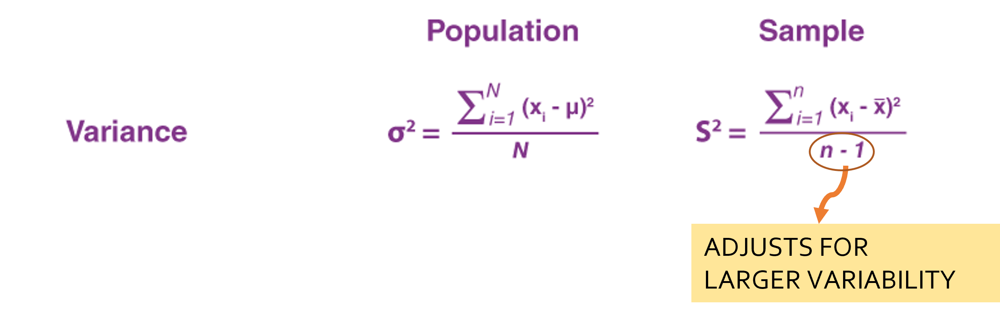
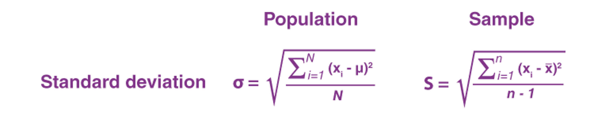
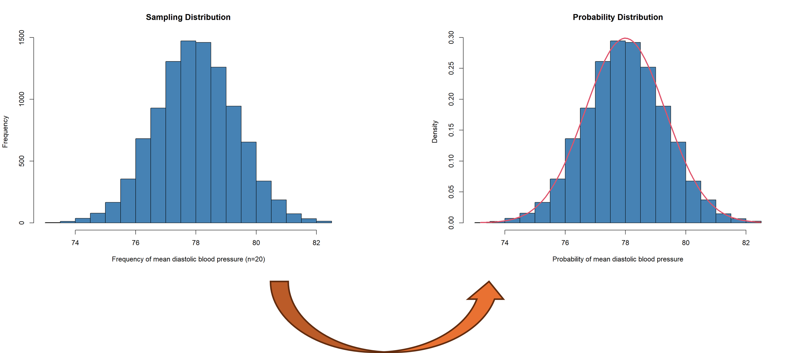
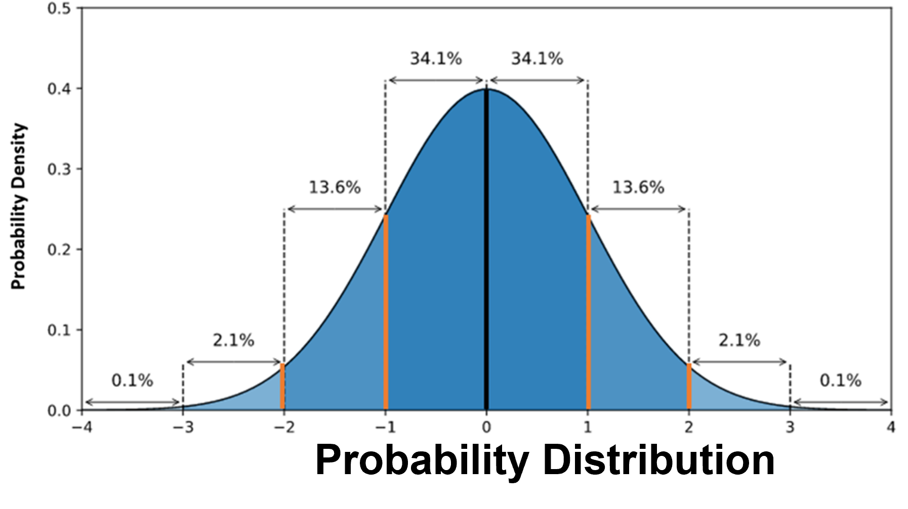
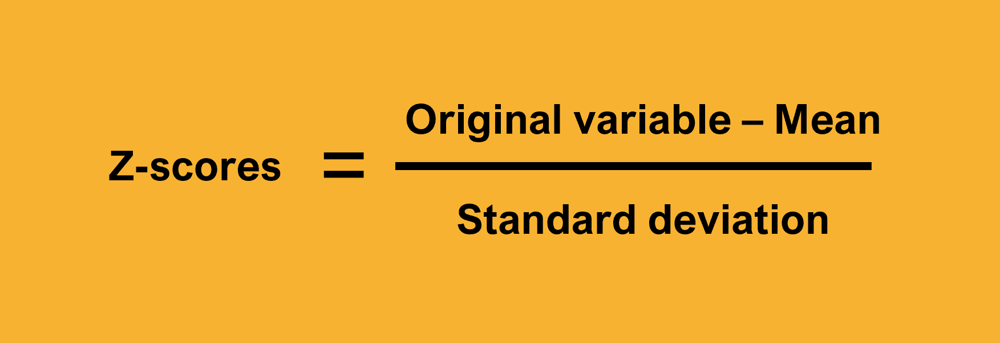
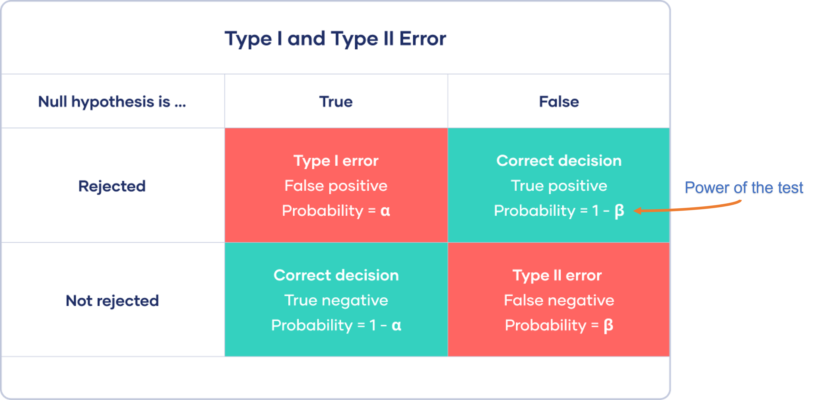
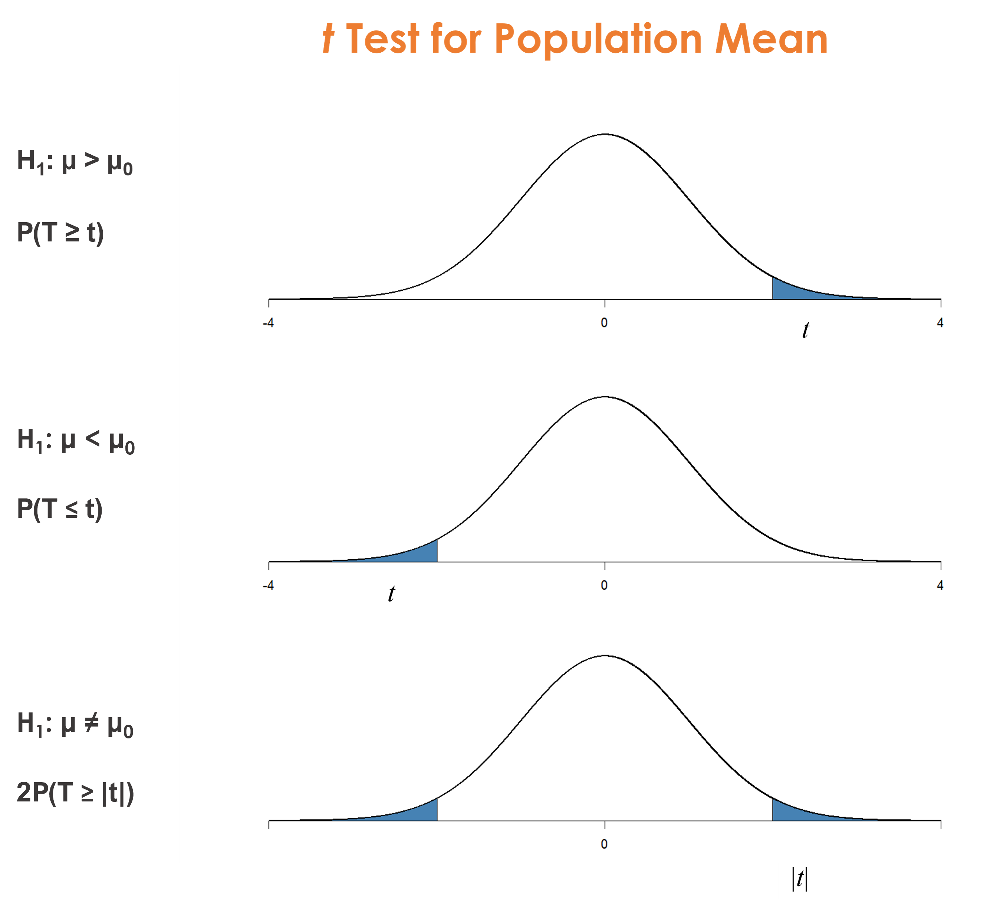
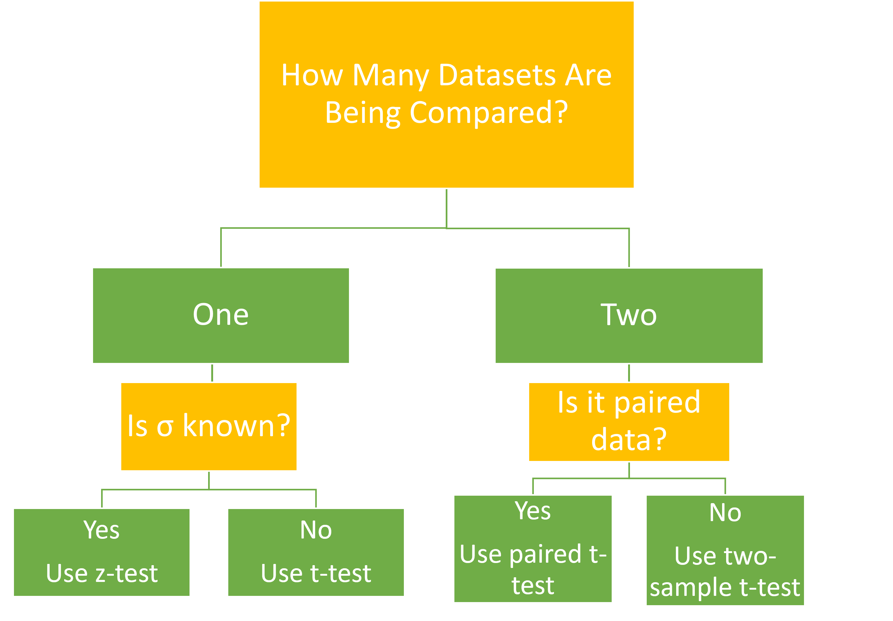

# Statistical Foundations Part1

```{=html}
<style>
    .div-1 {
        background-color: "white"; text-align:left;
    }
    .fragment {
        background-color: "white"; text-align:left;
    }
</style>
```
<body>

::: div-1
# ILOs
<br>
•	Critically assess the basic principles of different statistical techniques. <br><br>
•	Be able to select the correct statistical test depending on the experimental design and data type. <br><br> 
•	Use R syntax and ecosystem to perform data analysis tasks.

:::

</body>

## Contents
<br>
1. Descriptive Statistics<br><br>

2. Inferential Statistics<br><br>

3. Hypothesis Testing

# 1. Sample Statistics
<br>

. . .

<font size = "6"> ▪️ A **Sample or Descriptive Statistic** is a number that summarises data. </font><br><br>

. . .

<font size = "6">▪️ Some of the most common sample statistics are the **mean**, the **standard deviation**, the **median**, the **maximum**, and the **minimum**.</font>


## 1.1 Measures of Central Tendency

## A) Mean

```{=html}
<style>
    .div-1 {
        background-color: "white"; text-align:left;
    }
    
    .div-2 {
        background-color: "white"; text-align:center;
    }
    
    .div-3 {
        background-color: "white"; text-align:left;
    }
</style>
```
<body>

::: div-1
The most popular measure of central tendency is the **mean** also known
as *the simple average*.
:::

<br>

::: div-2
$\LARGE\bar{x}=\frac{x_{1} + x_{2} + x_{3} +....+ x_{1}}{n}$
:::

::: div-3
<br>**Downside of using the mean as measure of central tendency?**
:::

</body>

## B) Median

. . .

<font size="6">A better measure of Central Tendency is the **Median** which represents
the *middle number in an ordered dataset* and is NOT affected by
outliers. </font><br>


## 1.2 Asymmetry
<br><br> 

. . .

<font size="6">A measure of Asymmetry in a dataset is **Skewness**.</font> <br> <br>

. . .

<font size="6">**Skewness** indicates if the observations in a dataset are concentrated
(skewed) on one side.</font>

## Example:

```{=html}
<style>
div.gray { background-color:#ebf5ed; border-radius: 5px; padding: 20px;}
</style>
```
::: gray
<font size="6"> The file `event_times.txt` contains the time (s) when
consecutive cell divisions occur in a cell line culture. <br> We want to
examine the distribution of waiting times between successive cell
divisions. </font size>
:::

```{r, setup, include=FALSE}
## 1. First set the working directory
knitr::opts_knit$set(root.dir ="~/Bioinformatics_MSc/Teaching/Data Science Summer Course/Course Material/Lipton_Training_April_2025/Lectures")
```


## 1. Calculate waiting times


We are interested in calculating the waiting times between cell
divisions
<br>

```{r}
#1. Load the data in a vector:
div.time <- scan("Data/event_times.txt")

#2. Calculate waiting times
diff.time <- diff(div.time)
```

## 2. Get descriptive statistics

We can use the `summary()` function to get the main descriptive
statistics for this dataset:

```{r}
summary(diff.time)
```

<br>

. . .

Take a note of the Mean and Median values

## 3. Create a histogram of waiting times

```{r, echo=FALSE, warning=FALSE, message=FALSE, hist-plot, dev='png', fig.show='hide'}
library(ggplot2)
# convert diff.time into a dataframe
wait.time <- as.data.frame(diff.time)
# create a histogram with ggplot2
hist1 <-ggplot(wait.time, aes(x=diff.time)) +
  geom_histogram(binwidth = 0.5, colour = "white", fill = "red4") + 
  theme_bw() + 
  labs(x = "waiting time (s)", title = "histogram of cell division waiting times") + 
  scale_x_continuous(limits = c(0, 3.5), breaks = seq(0, 3.5, 0.5))
hist1
```

`){fig-align="centre"}


## 4. Summary

. . .

<font size="6">▪️ If **Mean \> Median** the data have a *positive or right skew*.</font><br><br>

. . .

<font size="6">▪️ If **Mean \< Median** the data have a *negative or left skew*.</font><br><br>

. . .

<font size="6">▪️ If **Mean = Median** the data are completely *symmetrical*.</font><br><br>
  

## Quiz

What type of distribution/skew do we have in this case?

`){fig-align="left"
width="50%"}

## 1.3 Measures of variability

<br>

. . .

**Univariate Measures of Dispersion**:<br><br>

. . .

-   **Variance** <br><br>

. . .

-   **Standard Deviation**<br><br>

. . .

-   **Coefficient of Variation**

## A) Variance

<br><br>
{width=100%}

## Sample Variance
<br>

. . .

<font size="6"> ▪️ Sample variance $s^2$ measures the *dispersion* of a set of data
    points around their mean value.</font><br><br>

. . .

<font size="6"> ▪️ The variance formula for the sample is more **conservative**.</font><br><br>

. . .

<font size="6"> ▪️ The **(n-1)** term in the formula accounts for the
    possibility that the variance captured by the sample is more than
    the variance of the population.</font>

    
## B) Standard Deviation

<br> 

. . .

<font size="6"> ▪️ Variance calculations can often result in large values as the term
$(x_{i}-\bar{x})^2$ is squared. </font><br><br>

. . .

<font size="6">▪️ Solution: use the square root instead. </font><br><br>

{width=100%}

## C) Coefficient of Variation

<br>

. . .

<font size="5"> ▪️ The **Coefficient of Variation (CV)** or **Relative Standard Deviation
(RSD)** is used to compare the standard deviations of
data recorded in different units, e.g. Kg vs g.</font>


{width=90%}

. . .

<font size="5"> ▪️ The RSD or CV can also be expressed as a percentage.</font>

## 2. Inferencial Statistics

<br>
```{=html}
<style>
div.gray { background-color:#ebf5ed; border-radius: 5px; padding: 20px;text-align:left;}
</style>
```
::: gray
<font size="6"> **Inferential Statistics** refer to the branch of Statistics that rely
on *Probability Theory* and *Distributions* to predict population values
based on sample data. </font size>
:::

## 2.1 Sampling Error
<br><br>

. . .

-   Sample statistics can be used for making inferences for the whole
    population. <br><br>

. . .

-   But how can we be sure that these statistics are reliable and close
    to the true population parameters?

##  

```{=html}
<style>
div.gray { background-color:#ebf5ed; border-radius: 5px; padding: 20px; text-align: left;}
</style>
```
::: gray
<font size="6"> Let's go back to the example of trying to calculate the
mean diastolic blood pressure (MDBP) for the adult population of
Massachusetts. In an effort to standardise our experiment, we have
collected three samples of 20 volunteers each and the mean values are:
**75.2, 79.5, 80.1 mm Hg**.</font>
:::

. . .

<font size="5">This difference between sample means is called **Sampling Error** or **Sampling Variability**</font>

## Manage Sampling Error

<br>

```{=html}
<style>
div.gray { background-color:#ebf5ed; border-radius: 5px; padding: 20px;}
</style>
```
::: gray
The best way to reduce the sampling error is by increasing the sample
size.
:::

## 2.2 Sampling distribution

<br>
```{=html}
<style>
div.gray { background-color:#ebf5ed; border-radius: 5px; padding: 20px;text-align:left;}
</style>
```
::: gray
<font size="6"> We can use a simple simulation example to see what happens when we draw repeated samples of equal size from the same population. <br><br> This means any variation observed will be due to sampling error. </font size>
:::


##  1. Simulate sampling distribution
<br>

. . .

<font size="6"> ▪ Define a normally disitributed polulation with mean value MDBP = 78 mm Hg and sd = 6.</font> <br>

. . .

<font size="6"> ▪ Draw 10,000 samples of size 20 from the above population. </font><br>

. . .

<font size="6"> ▪ Examples of sample means </font>

```{r, echo=FALSE}
set.seed(0)

#define number of samples
n = 10000

#create empty vector of length n
sample_means = rep(NA, n)

#fill empty vector with means from a "sample" of 20 subjects from a normal distribution
for(i in 1:n){
  sample_means[i] = mean(rnorm(20, mean=78, sd=6))
}

#view first six sample means
head(sample_means)
```


```{r, echo=FALSE, warning=FALSE, message=FALSE, sample-dist-plot, dev='png', fig.show='hide'}
hist(sample_means, main = "Sampling Distribution", 
     xlab = "Frequency of mean diastolic blood pressure (n=20)", col = "steelblue")
```

## 2. Sampling Distribution Histogram
`){fig-align="centre"}


```{r, echo=FALSE, warning=FALSE, message=FALSE, sample-dist-normal-plot, dev='png', fig.show='hide'}

data <- sample_means

# Histogram
hist_data <-hist(data,prob=TRUE, 
     main = "Probability Distribution", 
     xlab = "Probability of mean diastolic blood pressure", 
     col = "steelblue")

#define x and y values to use for normal curve
x_values <- seq(min(data), max(data), length = 100)
y_values <- dnorm(x_values, mean = mean(data), sd = sd(data)) 
y_values <- y_values * diff(hist_data$mids[1:2]) *2

#overlay normal curve on histogram
lines(x_values, y_values, lwd = 3, col=2)
```

## 2.2.1 Probability Distributions
<br><br>

. . .

<font size="6"> ▪ A sampling distribution shows the expected range and frequency of outcomes when we repeat the same sampling process.</font>
<br>

. . .

<font size="6"> ▪️ An alternative way of thinking of distributions is in terms of how **likely** it is for an outcome to occur instead of how often it occurs.</font> 

## Probability Distributions


. . .


<font size="6">They help convert the frequency of an outcome into a **probability of observing this outcome** by consulting the probability distribution.</font>

. . .

{fig-align="center" width="90%"}


## Normal Probability Distributions

<font size="5">Completely symmetrical with the most probable values centred around the mean.</font><br>


`){fig-align="center" width="55%"}


## Standard Normal Distribution

<br>

{fig-align="center"
width="70%"}

<font size="5"> A special normal distibution with a mean = 0, and sd = 1 [*N*(0,1)].</font>

## z-score standardisation

<font size="5">If we have approximately normally distributed data, we can
    apply **z-score standardisation** to transform the dataset into one with a standard normal distribution.</font>

{fig-align="center"
width="60%"}

## z-scores

. . .

<br> <font size="5">Once we have acquired the z-scores we can compare them against probability tables for the probability of getting this score.</font>

{fig-align="center"
width="80%"}

## Normal Distribution Empirical Rule

<br> **A distribution is normal if:**

```{=html}
<style>
div.gray { background-color:#ebf5ed; border-radius: 5px; padding: 20px;}
</style>
```
::: gray
-   Around 68% of scores fall within 1 standard deviation above and
    below the mean.<br><br>
-   Around 95% of scores fall within 2 standard deviations above and
    below the mean.<br><br>
-   Around 99.7% of scores fall within 3 standard deviations above and
    below the mean.
:::


## 2.3 The Central Limit Theorem

<br>

. . .

The **Central Limit Theorem** shows the following:

```{=html}
<style>
div.gray { background-color:#ebf5ed; border-radius: 5px; padding: 20px;}
</style>
```
::: gray
When we increase the sample size (or the
number of samples), then the sample mean will be closer to the
population mean (**Law of Large Numbers**).
:::

## Central Limit Theorem

```{=html}
<style>
div.gray { background-color:#ebf5ed; border-radius: 5px; padding: 20px;}
</style>
```
::: gray
"If we have a sample with more than 30 observations, we can accept that
it is coming from a sampling distribution with a mean equal to the
population mean".
:::

## Central Limit Theorem Implications<br><br>

. . .

<font size="6"> ▪️ With multiple large samples, the **sampling distribution** of the
    mean is normally distributed, even if the original variable is not.</font> <br><br>

. . .

<font size="6"> ▪️ We can use parametric tests for large samples from populations with
    any kind of distribution as long as other important assumptions are
    met.</font> <br><br>

. . .

<font size="6"> ▪️ For small samples, the assumption of normality is important because
    the sampling distribution of the mean isn't known.</font>

## 2.4 Standard Error

<br>

. . .

-   The **standard error** statistic tells us how variable the *sampling
    distribution* is. <br>

$$σ/\sqrt{n}$$

## Standard Error Definition

```{=html}
<style>
div.gray { background-color:#ebf5ed; border-radius: 5px; padding: 20px;}
</style>
```
::: gray
"The standard error of an estimate is the standard deviation of the
estimate's sampling distribution".
:::

<br>

. . .

❕<font size="6"> The key point to remember is that the standard error
(**SE**," or **se**) is a measure of the **spread**, or dispersion, of
the sampling distribution. </font size>

## Summary

<br><br>

. . .

[**Standard Deviation**]{style="color:blue"} tells us how far each
value lies from the mean within a single dataset (A **descriptive** statistic).<br><br> 

. . .

[**Standard Error**]{style="color:blue"} tells us how accurately our sample data represents the whole population (An **inferential** statistic).


## 2.5 Confidence Intervals

. . .

<br>

<font size="6">▪️ Another way of estimating how well the sample describes the population is by calculating **confidence intervals**. </font><br>

. . .

<font size="6">▪️ For given α the margin of error *m* for a CI is:
    $m = mean ± Z_{a/2}*SE$.</font>
    
. . .

<font size="6">▪️ Confidence Intervals are a range of values where the population mean is likely to fall. </font><br>


## Common confidence intervals and corresponding Z scores

<br><br>

| Desired CI | Z Score |
|:----------:|:-------:|
|    90%     |  1.645  |
|    95%     |  1.96   |
|    99%     |  2.576  |


## NOTE 📝

```{=html}
<style>
div.gray { background-color:#f5f4eb; border-radius: 5px; padding: 20px;}
</style>
```
::: gray
-   If se and CI are small, we can be fairly confident the sample mean
    is a good estimate of the population mean.<br><br>
-   If se and CI are large, this implies they are uninformative. The
    true population mean can fall anywhere in the range.
:::

## Confidence vs Significance

. . .

-   The **se** and **CI** tells us how confident we are that we have captured    the true population mean but does not tell us if the result is
    *statistically significant*. <br><br>
    
. . .

-   To be able to say this we need to look at the **probability
    statistics** calculated using hypothesis testing.

# 3. Hypothesis Testing

{fig-align="center"
width="70%"}

## 3.1 Hypothesis Definition

<br> So what is a hypothesis? 🤔<br><br>

. . .

<font size="6">[Intuitively **"A hypothesis is a statement that can be tested"**.
    <br><br>]{style="color:#347aeb"}</font>

. . .

<font size="6">Example: The mean length of newborn babies in the UK is equal to
    50cm.</font><br><br>

. . .

<font size="6">A hypothesis can be **TRUE** or **FALSE**. The two scenarios are
    covered by the **Alternative** and **Null** Hypothesis respectively.</font>

## Null and Alternative hypothesis

```{=html}
<style>
div.gray { background-color:#ebf5ed; border-radius: 5px; padding: 20px;}
</style>
```
::: gray
-   The Null hypothesis ($H_{0}$) says what our theory predicts will be
    FALSE.

-   The Alternative hypothesis ($H_{1}$) says what our theory predicts
    will be TRUE.
:::

. . .

When conducting hypothesis testing the alternative hypothesis can be two
sided or one sided.

## 3.2 Two-sided Hypothesis Testing

<br>


<br>

## 💡 Important!

```{=html}
<style>
div.gray { background-color:#ebf5ed; border-radius: 5px; padding: 20px;}
</style>
```
::: gray
Remember that the alternative hypothesis $H_{1}$ cannot be
proved.<br><br> What we are trying to do is reject the Null hypothesis
$H_{0}$.
:::

## 3.3 One-sided Hypothesis Testing

### Example:

```{=html}
<style>
div.gray { background-color:#ebf5ed; border-radius: 5px; padding: 20px; text-align:"left";}
</style>
```
::: gray
<font size="6"> According to the National Institute of Health in the
U.S. an estimated 31.9% of U.S. adolescents aged 13-18 had any anxiety
disorder 😟 in the period 2001-2003.</font>
:::

## Forming our Hypothesis

<br>

[We hypothesise that in recent years the prevalence of anxiety disorders
in adolescents in the U.S. has risen.]{style="color:#347aeb"}
<br>

. . .

## {fig-align="center"}

<br>

## Hypothesis Testing Considerations

<br>

. . .

<font size="6">In hypothesis testing we have three things we need to define:</font> <br><br>

. . .

<font size="6">A) The Null Hypothesis $H_{0}$ we are trying to reject.</font><br><br> 

. . .

<font size="6">B) The rejection region.</font><br><br> 

. . .

<font size="6">C) The significance level.</font>

## 3.4 Rejection Region
<br>

. . .

After defining the Null Hypothesis we need to define the Rejection Region. <br><br>

. . .

How is the rejection region defined?

## Example
```{=html}
<style>
div.gray { background-color:#ebf5ed; border-radius: 5px; padding: 20px; text-align:left;}
</style>
```
::: gray
<font size="6">Assume we are interested in testing the following statement: "The
average mean birth weight of babies born 👶 in a large UK
hospital🏥 is 3900 g".</font>
:::

. . .

<font size="6">We don't agree with this statement and we declare that: "The average
birth weight of newborn babies in this hospital is different
to 3900 g".</font>

. . .

<font size="6">
$H_{0}$: birth weight = 3900 g <br>
$H_{1}$: birth weight ≠ 3900 g </font>

## 1. Define population
```{=html}
<style>
div.gray { background-color:#ebf5ed; border-radius: 5px; padding: 20px; text-align:left;}
</style>
```
::: gray
After obtaining the birth records for all babies in this hospital born in the last year the mean weight was **3460 g** with a sd of **495** and the data were normally distributed **N\~(μ=3460, σ=495)**. <br>
:::

## 2. Draw the above distribution:

```{r, echo=FALSE, warning=FALSE, message=FALSE, reject-plot, dev='png', fig.show='hide'}
#define population mean and standard deviation
population_mean <- 3460
population_sd <- 495

#define upper and lower bound (the boundaries of the normal distributions are ~4 standard deviations from the true mean)
lower_bound <- population_mean - 4*population_sd
upper_bound <- population_mean + 4*population_sd

#Create a sequence of 1000 x values based on population mean and standard deviation
x <- seq(1480, 5440, 0.001)
#create a vector of values that shows the height of the probability distribution
#for each value in x
y <- dnorm(x, population_mean, population_sd)

#plot normal distribution with customized x-axis labels
plot(x,y, type = "l", lwd = 2, axes = FALSE, xlab = "", ylab = "")
sd_axis_bounds = 6
axis_bounds <- seq(-sd_axis_bounds * population_sd + population_mean,
                    sd_axis_bounds * population_sd + population_mean,
                   by = population_sd)
axis(side = 1, at = axis_bounds, pos = 0)


## add rejection region
# 1. shade p-value/2 region in left tail
polygon(x = c(1480, seq(1480, 2470, 0.01), 2470),
        y = c(0, dnorm(seq(1480, 2470, 0.01), 3460, 495),0), 
 
               col = 'steelblue')


# 2. shade p-value/2 region in right tail
polygon(x = c(4450, seq(4450, 5440, 0.01), 5440),
        y = c(0, dnorm(seq(4450, 5440, 0.01), 3460, 495), 0), 
        col = 'steelblue')

```

### Two-sided rejection plot

<font size="5">**Rejection region** at *significance level α = 0.05*.</font>

`){fig-align="centre" width="60%"}

## Conclusions

```{=html}
<style>
div.gray { background-color:#ebf5ed; border-radius: 5px; padding: 20px;}
</style>
```
::: gray
-   The significance level **α** represents the probability of rejecting the
    null hypothesis **if it is true**. <br><br>
-   If the null hypothesis value falls inside the rejection region, then
    we can reject the Null hypothesis
:::

## Question:

<font size="6">From the Figure below, can we can reject the Null hypothesis?</font>

{fig-align="center"
width="70%"}

## 3.5 Type I and Type II Errors

<br>

```{=html}
<style>
div.gray { background-color:#ebf5ed; border-radius: 5px; padding: 20px;}
</style>
```
::: gray
-   **Type I** error is when we reject the Null hypothesis when it is in
    fact TRUE. **[FALSE POSITIVE]**.<br><br>
-   **Type II** error is when we fail to reject the Null hypothesis when
    it is in fact FALSE. **[FALSE NEGATIVE]**.
:::

## Type I Errors Facts

<br>

-   The probability of making a Type I error is **α**. <br><br>

-   Type I errors are more serious and tests are usually designed to
    reduce the probability of type I errors (e.g. Post-Hoc tests).


## Type II Error Facts

<br> <font size="6">

. . .

-   The probability of a type II error is denoted as **β** and depends on the sample size and the population variance.<br><br>

. . .


-   **Power of a Test 1-β**: the probability of **TRUE POSITIVES**. 
    <br><br>

. . .

-   **To increase the Power of a test (1-β) we can increase the sample
    size.** </font size>

## Test Power Summary



## 3.6 Test of Significance
<br>
```{=html}
<style>
div.gray { background-color:#ebf5ed; border-radius: 5px; padding: 20px; text-align:left;}
</style>
```
::: gray
**A test of significance finds the probability of getting an outcome as
extreme or more extreme than the actually observed outcome assuming the
Null hypothesis is TRUE.**
:::

. . .

<font size ="6"> ▪️ we can use the **z scores** to assess how far away the estimate is from the population parameter.</font>

. . .

<font size ="6">▪️ We call these scores a **test statistic** which has the purpose of measuring compatibility between the Null hypothesis and the data.</font>

## z-statistic

<br><br>
```{=html}
<style>
div.gray { background-color:#ebf5ed; border-radius: 5px; padding: 20px; text-align:center;}
</style>
```
::: gray
$z=\frac{estimate -hypothesised\;value}{standard\;deviation\;of\;the\;estimate}$<br>
:::

. . .

<font size="5">
▪️ estimate = the observed value for a statistic acquired from the
    sample. <br>
▪️ hypothesised value = the value we attribute to the parameter under
    the Null hypothesis. <br>
▪️ standard deviation of the estimate =the sd of the
    sampling distribution.</font>

## Example

<br>

```{=html}
<style>
div.gray { background-color:#ebf5ed; border-radius: 5px; padding: 20px; text-align:left;}
</style>
```
::: gray
Now assume we want to test whether there is a difference in birth weight between boys 👦 and girls 👧 in the country. 
:::

. . .

<font size="6">
What does our hypothesis look like?</font>

## Sampling

<br>

```{=html}
<style>
div.gray { background-color:#ebf5ed; border-radius: 5px; padding: 20px; text-align:left;}
</style>
```
::: gray
To test the hypothesis we look at many different samples we find boys are on average 200 g heavier than girls with a sd=60 g. <br>
Is this difference **statistically significant?**
:::

## 1. Calculate the z-statistic

<br> <font size ="6"> The z statistic in this case would be:
$z= \frac{200 - 0}{60} = 3.33$</font><br><br>

. . .

-   <font size ="6">This means that we have observed a sample estimate \>3 SD away from the hypothesised value of the parameter (diff = 0).</font><br><br>

. . .

-   <font size ="6">Since the sample sizes are sufficiently large the z statistic will have approximately the standard normal distribution
    ***N*****(0,1)**.</font><br><br>

. . .

-   <font size ="6">Based on the z statistic can we reject the Null hypothesis?</font>


## 2. Conduct Significance Test

<br>

. . .

In our example this translates as:

. . .

P(Z ≤ -3.33 or Z ≥ 3.33) --\> P(\|Z\|≥ 3.33) = 2P(Z ≥ 3.33)<br><br>

. . .

From the table of z scores we find: <br>

2P(Z≥ 3.33) = 2(1-0.9996) = 0.0008. <br><br>

. . .

This is the **P-value** of the test.

## P-value Definition

```{=html}
<style>
div.gray { background-color:#ebf5ed; border-radius: 5px; padding: 20px;}
</style>
```
::: gray
The **P-value** of a test is the probability that the test
statistic would take a value as extreme or more extreme than that
actually observed assuming that $H_{0}$ is true. <br><br>
:::

## Statistical Significance

<br>

```{=html}
<style>
div.gray { background-color:#ebf5ed; border-radius: 5px; padding: 20px;}
</style>
```
::: gray
If the P-value is ≤ α, we say that the data are **statistically
significant at level α**.
:::

<br>

. . .

-   Most commonly we choose **α=0.05** which means that if $H_{0}$ was
    indeed TRUE, we would not observe this test statistic value more
    than 5% of the time.<br><br>


## 3.7 Estimating Population Mean
<br>

. . .

-   When σ is **unknown**, we must first estimate σ before we
    can make any inference for μ! <br><br>

. . .

-   In this case, we use the sample standard deviation *s* to estimate
    the population standard deviation σ.

## One-sample *t*-statistic
<br>

. . .

<font size ="6">The new statistic is called: **one-sample *t*-statistic**:

$${t = \frac{\bar{x} - μ}{s / \sqrt{n}}}$$ </font><br>

. . .

<font size ="6">The denominator is called the **standard error of the sample mean** and it is used to estimate the unknown standard deviation of the sample
mean: $$σ / \sqrt{n}$$</font>

## The *t*-statistic Distribution

<br>

-   Unlike the **z** statistic the **t** statistic **does not** follow a normal distribution. <br><br>

. . .

-   It follows a new type of distribution called a
    ***t*****-distribution** or **Student's *t*-distribution**.

## 💡 Important

<br>

```{=html}
<style>
div.gray { background-color:#ebf5ed; border-radius: 5px; padding: 20px;}
</style>
```
<div class = "gray">

-   The type of *t*-distribution for a given sample is dependent on the sample size (n)!

    </div>

    <br>

. . .

-   To know the type of *t*-distribution we need the **degrees of
    freedom k=n-1**. <br><br>

. . .

-   We use *t(k)* to define a *t* distribution with *k* degrees of
    freedom.

## *t*-statistic Distribution Examples

```{r, echo=FALSE, warning=FALSE, message=FALSE, t-dist-plot, dev='png', fig.show='hide'}
curve(dnorm(x), -4, 4, col = "red", ylab = "")
curve(dt(x, df = 3), add = TRUE)
curve(dt(x, df = 9), col = "dark green", add = TRUE)
legend("topright", bty = "n",
  legend = c("N(0,1)", "t(3)", "t(9)"),
  lty = c(1, 1, 1),
  col = c("red", "black", "dark green"), 
          title= "Density curves")
```

`){fig-align="center"}

## *t*-Test P-Values

. . .

<font size ="5">For a random standard variable T having the t**(n-1)** distribution,
the **P-value** for a test of **$H_{0}$** against all possible alternatives is
calculated as:</font>

```{=html}
<style>
div.gray { background-color:#ebf5ed; border-radius: 5px; padding: 20px;}
</style>
```
::: gray
<font size ="5">
A)  For $H_{1}: μ > μ_{0}$ the P-value is: P(T ≥ t) <br><br>
B)  For $H_{1}: μ < μ_{0}$ the P-value is: P(T ≤ t) <br><br>
C)  For $H_{1}: μ ≠ μ_{0}$ the P-value is: 2P(T≥ \|t\|) </font>
:::


## t-Test for a Population Mean

{fig-align="center"
width="70%"}

## 3.8 Comparing Two Means

<br>

```{=html}
<style>
div.white { background-color:"white"; border-radius: 5px; padding: 20px; text-align:left;}
</style>
```
::: white
<font size ="6">
▪️ In many research studies our purpose is to see if a treatment has an
effect on a population. <br><br>
▪️ For the study results to be valid we need to include a **control** group as well as the **treatment group**. </font><br>
:::

. . .

<font size ="6">[▪ This is often called the **Two-sample problem**.]{style="color:#347aeb"}</font>

## Two-Sample Problem Summary

<br><font size ="6">

-   The goal of inference is to compare the response in two
    groups.<br><br>
-   Each group is considered to be a sample from a distinct population with means $μ_{1}$ and $μ_{2}$, and sd $σ_{1}$ and $σ_{2}$ respectively.
    <br><br>
-   The responses of one group are independent of those of the other. </font><br><br>

. . .

📝 <font size ="6">In addition, there is no need the two groups to have the same size,
as would be the case in matched-pair designs.</font>

## Example

<br>

```{=html}
<style>
div.gray { background-color:#ebf5ed; border-radius: 5px; padding: 20px; text-align:left;}
</style>
```
::: gray
<font size ="6">We have a clinical trial where volunteers are randomly
assigned to a group receiving a treatment and a control group receiving
a placebo.</font>
:::

. . .

<font size ="5">▪️ The same variable is measured in both groups but we call the
    variable $x_{1}$ in the treatment group and $x_{2}$ in the placebo
    group as their distribution may be different. </font><br>

## Comparing Populations

. . .

-   <font size ="6">Our main aim is to compare the two population means by testing the hypothesis $H_{0}$: $μ_{1}$ = $μ_{2}$.</font><br><br>

. . .

-   <font size ="6">Inference is based on the two samples comprised of the two groups of volunteers.</font><br><br>
    
. . .


| Population | Sample Size |   Sample Mean   | Sample standard deviation |
|:----------:|:-----------:|:---------------:|:-------------------------:|
|     1      |   $n_{1}$   | ${\bar{x_{1}}}$ |          $s_{1}$          |
|     2      |   $n_{2}$   | ${\bar{x_{2}}}$ |          $s_{2}$          |


## 3.9.1 The Two-Sample *t*-statistic

<br>

-   <font size ="6">When $σ_{1}$ and $σ_{2}$ is **unknown** we compute the **two-sample *t*-statistic**.</font><br><br>

$${t = \frac{(\bar{x_{1}} - \bar{x_{2}}) - {(μ_{1} - μ_{2})}}{\sqrt{(\frac{s_{1}^2} {n_{1}})-(\frac{s_{2}^2} {n_{2}})}}}$$<br><br>

## When to reject the Null Hypothesis?

<br>

```{=html}
<style>
div.gray { background-color:#ebf5ed; border-radius: 5px; padding: 20px; text-align:left;}
</style>
```
::: gray
📝 <font size ="6">To decide whether we can reject the Null Hypothesis in favour of the Alternative $H_{1}$: $μ_{1}$ ≠ $μ_{2}$, we look at the p-values for the
*t(k)* distribution which is an approximation for the two-sample
*t*-statistic distribution. <br><br> The degrees of freedom *k* are
either approximated by software or are the smaller of ${n_{1} - 1}$ vs
${n_{2} - 1}$.</font>
:::

## Summary of z & t-tests

{width="85%"}

## 📝 Considerations on Statistical Significance tests
```{=html}
<style>
div.white { background-color:"white"; border-radius: 5px; padding: 20px; text-align:left;}
</style>
```
<div class = "white">
<font size ="6">
1.  Exact some caution in putting too much weight on statistical          significance.</font><br><br>
<font size ="6">
2.  Small effects can be highly significant (very small P-values) but
    the practical importance of this effect can be questionable.</font><br>
<font size ="6">  
3.  On the other hand, if we fail to reject the Null hypothesis this
    doesn't necessarily mean $H_{0}$ is TRUE especially when the test
    has low power.</font><br><br>
    </div>

## Effect size


. . .

-   <font size ="6">To know if an observed difference is not only statistically significant but also important or meaningful, we can calculate its **effect size.**</font><br>

$${effect-size = \frac{mean_{treatm} - mean_{control}}{sd_{control}}}$$
<br>

. . .

-   <font size ="6">Effect size is a standardized measure of the difference between groups. </font><br>

. . .

-   <font size ="6">All effect sizes are calculated on a common scale. </font>

## Effect size interpretation
<br>
```{=html}
<style>
div.gray { background-color:#bce9f7; border-radius: 5px; padding: 20px;text-align:left;}
</style>
```
::: gray
😕  <font size ="7">
 < 0.1 = trivial effect </font><br>
😐 <font size ="7">
0.1 - 0.3 = small effect </font><br>
🙂 <font size ="7">
0.3 - 0.5 = moderate effect </font> <br>
🎉 <font size ="7"> > 0.5 = large difference effect </font>
::: 
