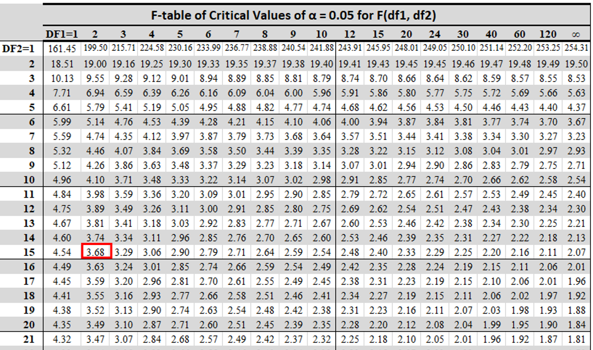
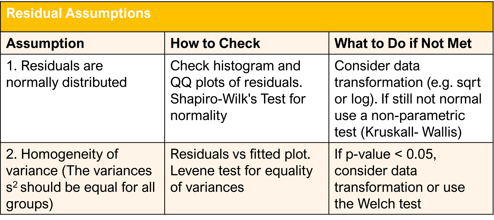

```{r, setup, include=FALSE}
## 1. First set the working directory
knitr::opts_knit$set(root.dir ="~/Bioinformatics_MSc/Teaching/Data Science Summer Course/Course Material/Lipton_Training_April_2025/Lectures")
```

# Statistical Foundations Part2

# 4. Analysis of Variance (ANOVA)

```{=html}
<style>
    .div-1 {
        background-color: "white"; text-align:left;
    }
    .fragment {
        background-color: "white"; text-align:left;
    }
</style>
```
<body>

::: div-1
## Introduction
<br>
<font size ="6">
▪️ A limitation with the t-test is that only two means can be compared at one time. <br><br>

▪️ However, in many experimental set-ups we want to compare more than two means simultaneously. <br><br>

▪️ Testing each pair of means with a t-test is not recommended as the probability of false positives increases with each test run. </font>

:::

</body>

## ANOVA Definiftion

. . .

Analysis of Variance (ANOVA) is the recommended method for determining whether or not there is a statistically significant difference between the means of three or more independent groups.

. . .

<style>
div.gray { background-color:#ebf5ed; border-radius: 5px; padding: 20px; text-align:left;}
</style>
<div class = "gray">
<br>
📝 ANOVA answers the question as to whether there is greater variability between groups than within groups.</div>

## ANOVA Hypothesis
<br>

. . .

- $${H_{0}: µ_{1} = µ_{2} = µ_{3} = … = µ_{k}}$$ The means are equal for each group. <br><br>

. . .

- $H_{1}$: at least one of the means is different from the others


## [📝 ANOVA models facilitate the analysis of many different kinds of experimental data and they are the workhorse of basic statistical analysis.]{style="color:#347aeb"}


## 4.1 One-Way ANOVA
<br>
<style>
div.gray { background-color:#ebf5ed; border-radius: 5px; padding: 20px; text-align:left;}
</style>
<div class = "gray">
<font size ="6">One-way ANOVA predicts how the mean value of a numeric variable (the **response variable**) is affected by the levels of a categorical variable (the **predictor variable**).</font></div>

. . .


<font size ="5">These levels may represent:</font> <br>

. . .

<font size ="5">a) quantitative variations (e.g. the effect of different concentrations of an antibiotic on bacterial growth). </font><br><br>

. . .

<font size ="5">b) qualitative variations (e.g. the effect of apple cultivar on sugar/acid ratio).</font> 

## ANOVA and Linear Regression
<br>

- The definition of ANOVA is similar to the definition of simple linear regression you have already encountered earlier. <br><br>

. . .

- <span style="color:#4287f5">**In fact, ANOVA and regression are both special cases of the general linear model.**</span> 

## 4.1.1 ANOVA Principles
<br>

- <font size ="6">ANOVA examines the magnitudes of three different sources of variation in the data:</font><br>

. . .

<font size ="6">A) **The Total Variation**: the variation among all the units in the study. </font><br>

. . .

<font size ="6">B) **Between-Group Variation**: the variation due to the effect of experimental treatments or control groups (**explained variation**).</font><br>

. . .

<font size ="6">C) **Within-Group Variation**: the variation due to other sources (**error variation**).</font>

## ANOVA in a Nutshell
<br>
<style>
div.gray { background-color:#ebf5ed; border-radius: 5px; padding: 20px; text-align:left;}
</style>
<div class = "gray">
<font size ="6"> ANOVA is looking at changes in variation. If the amount of variation between treatments is sufficiently large compared to the within-group variation, this suggests that the treatments are probably having an effect.</font></div><br>

. . .

- <font size ="6">But how is each type of variation calculated?</font>

## Example
<style>
div.gray { background-color:#ebf5ed; border-radius: 5px; padding: 20px; text-align:left;}
</style>
<div class = "gray">
<font size ="6">Consider an experiment where we compare the bioaccesibility of Vitamin D depending on the type of flour used in a baked product.<br>
▪️ The fibres used are :wheat pea, apple, </font>

{width=90%}
</div>


## Import csv file `Fibre` into R
```{r, echo=FALSE, warning=FALSE, message=FALSE}
#Import csv file `Fibre` from the `Data` folder and look at its structure
fibre <-read.csv("Data/Fibre.csv", header = TRUE, sep=",")
knitr::kable(fibre[c(1:10),], caption = "First lines of Fibre dataset")
```

```{r, echo=FALSE, warning=FALSE, message=FALSE, }
## Convert the column `Replicate` into a factor:
#str(fibre)
fibre$Replicate <- as.factor(fibre$Replicate)
#str(fibre)
```
```{r, echo=FALSE, warning=FALSE, message=FALSE}
## 3. Find Bioaccessibility mean value and subtract it from all samples
fibre.mean <- mean(fibre$Bioaccessibility)

fibre$TotalMeanDiff <- fibre$Bioaccessibility - fibre.mean
```


```{r, echo=FALSE, warning=FALSE, message=FALSE, plot1, dev='png', fig.show='hide'}
library (tidyverse)
## Plot the bioaccessibility of each sample compared to the total mean bioaccessibility for the whole dataset
ggplot(fibre) +geom_point(aes(x = Replicate, y = Bioaccessibility)) +
    geom_linerange(aes(x = Replicate, ymin = fibre.mean, ymax = Bioaccessibility))+
    labs(x = "Fibre Type", y = "% Bioaccessibility") +
    facet_wrap(~Fibre, strip.position = "bottom")+
    ggtitle("Total variation")+
  geom_hline(yintercept = fibre.mean, color="blue")
  
```

## Plot raw data and total mean
`){fig-align="centre" width=50%}

. . .

<font size ="5">
- The distance of each sample from the blue line represents the deviation of each measurement from the total mean. The sum of all the deviations is zero. </font> 

## 1. Calculate the Total Variation (SST)
<br>

. . .

- <font size ="6">To find the total variation we need to find the **sum of squares of the deviations (SST)**.</font> 
```{r, echo=FALSE, warning=FALSE, message=FALSE}
total.variation <- sum(fibre$TotalMeanDiff^2)
total.variation
```

## 2. Calculate the Within-Groups Variation (SSE)
<br>
 
. . .

- <font size ="6">The next step is to calculate the *error or residual variation*.</font> <br><br>

. . .

- <font size ="6">First we need to calculate the means per group.</font> <br><br>
```{r, echo=FALSE, warning=FALSE, message=FALSE}
group.mean <- aggregate(fibre$Bioaccessibility, list(fibre$Fibre), FUN=mean)
colnames(group.mean) <- c("Fibre", "GM")
```

```{r, echo=FALSE, warning=FALSE, message=FALSE}
knitr::kable(group.mean[c(1:3),], caption = "'group.mean' table")
```


```{r, echo=FALSE, warning=FALSE, message=FALSE, plot2, dev='png', fig.show='hide'}
## Then we create the same plot as previously but we also add the group mean for each type of fibre. 
ggplot(fibre) +geom_point(aes(x = Replicate, y = Bioaccessibility)) +
   geom_linerange(aes(x = Replicate, ymin = group.mean$GM[3], ymax = Bioaccessibility), data=filter(fibre, Fibre == "Wheat"))+
   geom_linerange(aes(x = Replicate, ymin = group.mean$GM[2], ymax = Bioaccessibility), data=filter(fibre, Fibre == "Pea"))+ 
   geom_linerange(aes(x = Replicate, ymin = group.mean$GM[1], ymax = Bioaccessibility), data=filter(fibre, Fibre == "Apple"))+
   labs(x = "Fibre Type", y = "% Bioaccessibility") +
    facet_wrap(~Fibre, strip.position = "bottom")+
    ggtitle("Within Group variation")+
    geom_hline(yintercept = fibre.mean, color="blue")+
    geom_hline(data = data.frame(yint=group.mean$GM[3],Fibre = "Wheat"), aes(yintercept = yint), linetype = "dotted", colour = "red", linewidth = 1)+
  geom_hline(data = data.frame(yint=group.mean$GM[2],Fibre = "Pea"), aes(yintercept = yint), linetype = "dotted", colour = "red", linewidth = 1)+
  geom_hline(data = data.frame(yint=group.mean$GM[1],Fibre = "Apple"), aes(yintercept = yint), linetype = "dotted", colour = "red", linewidth = 1)
```
## Plot raw data, total mean & group means
`){fig-align="centre" width=50%}

. . .

<font size ="5">
- The distance of each sample from the red line is the difference of each measurement from the group mean. 
This is the ‘left over’ variation attributed to differences among individuals. </font>

## Within-group variability
<br>

- <font size ="6">To calculate the within-group variability we need to take the sum of squares for the deviations from each group mean. This is called the **residual sum of squares**. </font>

```{r, echo=FALSE, warning=FALSE, message=FALSE}
# Find residuals for each group
ResDiff1 <- fibre$Bioaccessibility[fibre$Fibre == "Wheat"] - group.mean$GM[3]
ResDiff2 <- fibre$Bioaccessibility[fibre$Fibre == "Pea"] - group.mean$GM[2]
ResDiff3 <- fibre$Bioaccessibility[fibre$Fibre == "Apple"] - group.mean$GM[1]
```


### Calculate sum of squares (**SSE**)
```{r, echo=FALSE, warning=FALSE, message=FALSE}
error.variation <- sum(c(ResDiff1^2, ResDiff2^2, ResDiff3^2))
error.variation
```

## 3. Between-Group Variation (SSG)
<br>

```{r, echo=FALSE, warning=FALSE, message=FALSE, plot3, dev='png', fig.show='hide'}
##Plot Bioaccessibility data again, but this time only show the means per group.
ggplot(data = group.mean, aes(x = Fibre, y= GM)) + 
  geom_point() +
    geom_linerange(aes(x = Fibre, ymin = fibre.mean, ymax = GM))+
    labs(x = "Fibre Type", y = "% Bioaccessibility") +
    ggtitle("Between Groups Variation")+
  geom_hline(yintercept = fibre.mean, color="blue")
```
## Plot total mean and group means
`){fig-align="centre" width=50%}

. . .

<font size ="5">
- The distance of each dot from the blue line is the difference between each group mean and the Total Mean. This is variation due to differences among treatment groups.</font> 

## Between Treatments Variability
<br>

- <font size ="6">As previously we need to calculate the sum of squares for these differences. This is a measure of the variability attributed to differences among treatments.</font>
```{r, echo=FALSE, warning=FALSE, message=FALSE}
Explained.Diff <- group.mean$GM - fibre.mean
```

### Calculate sum of squares (**SSG**)
```{r, echo=FALSE, warning=FALSE, message=FALSE}
explained.variation <- sum(6*Explained.Diff^2)
explained.variation
```

## Total Sum of Squares
<br>
<style>
div.gray { background-color:#ebf5ed; border-radius: 5px; padding: 20px;}
</style>
<div class = "gray">
  📝 The SUM of SQUARES we calculated earlier are related by the formula: <br>
  ${SST = SSG + SSE}$
  
  Thus the total variation is composed of two parts, one due to groups and one due to error. 
</div>

## 4.1.2 Degrees of Freedom in ANOVA
<br>

. . .

- <font size ="6">An issue with using the sum of squares we calculated previously, is that they are dependent on the sample size and the number of groups. </font><br><br>

. . .


- <font size ="6">To standardise the sum of squares we divide by the degrees of freedom for each type of variation.</font> 

## Degrees of Freedom Formula
<br>

<style>
div.gray { background-color:#ebf5ed; border-radius: 5px; padding: 20px;}
</style>
<div class = "gray"><font size ="6">
  📝 The Degrees of Freedom in ANOVA are related by the formula: <br>
  ${DFT = DFG + DFE}$
</font></div><br>

. . .

<style>
div.gray { background-color:#ebf5ed; border-radius: 5px; padding: 20px;}
</style>
<div class = "gray"><font size ="6">
DFT = (Number of observations - 1)<br>

DFG = (Number of treatment groups - 1)<br>

DFE = (Number of observations - Number of groups)</font>
</div>

## 4.1.3 Mean Squares
<br>

<style>
div.gray { background-color:#ebf5ed; border-radius: 5px; padding: 20px;}
</style>
<div class = "gray"><font size ="6">
The Sum of Squares for each type of variation in ANOVA is calculated as:

${MST = \frac{SST}{DFT}}$ <br>

${MSG = \frac{SSG}{DFG}}$ <br>

${MSE = \frac{SSE}{DFE}}$ </font></div>

. . .

<font size ="6">The Mean Sum of Squares is the standardised form of the Sum of Squares.</font> 


## 4.1.4 The *F* test

- The final question is whether we can reject the Null Hypothesis or not. <br><br>

. . .

- To decide this we use the **ANOVA *F* statistic**.

## F Statistic Definition
<br>

- <font size ="6">The *F* statistic is the ratio of MSG/MSE (the variation due to treatment over the variation due to error). </font><br><br>

. . .

- <font size ="6">If $H_{0} =$ TRUE the *F*-statistic is ~ 1 and if the Alternative hypothesis is true, it tends to be large.</font>

## The ANOVA *F* test
<br>
<style>
div.gray { background-color:#ebf5ed; border-radius: 5px; padding: 20px;}
</style>
<div class = "gray">
To test the Null Hypothesis in a One-Way ANOVA we calculate the *F* statistic:

$${F = \frac{MSG}{MSE}}$$ </div> 


## *F*-test P-Value
<br>
<style>
div.gray { background-color:#ebf5ed; border-radius: 5px; padding: 20px;}
</style>
<div class = "gray"><font size ="6">
The **P-value** of the *F* test is the probability that a random variable having the *F(I-1, N-1)* distribution is ≥ *F*, the calculated value of the *F* Statistic. </font></div>


## Example 
<br>

- Find the *F* statistic for the bioaccessibility problem and decide whether we can reject the Null Hypothesis. 

## 1. Calculate Degrees of Freedom
```{r, echo=FALSE, warning=FALSE, message=FALSE}
# Degrees of freedom  
dft <- 18-1
dfg <- 3-1
dfe <- 18-3
#Print values
dft
dfg
dfe
```

## 2. Find MSS
```{r, echo=FALSE, warning=FALSE, message=FALSE}
mst <- round(total.variation/dft, digits=2)
msg <- round(explained.variation/dfg, digits=2)
mse <- round(error.variation/dfe, digits=2)

# print results
paste("mst=", mst)
paste("msg=",msg)
paste("mse=",mse)

```

## 3. Find the *F* statistic
```{r, echo=FALSE, warning=FALSE, message=FALSE}
# F test
f <- round(msg/mse, digits=2)
paste("f=msg/mse=", f)
```

. . .

The *F* statistic is 6.77. 

## F Table
<br>
- </font>If we look at an F table for critical values for α=0.05, the critical value for *F(2,15)* is 3.68 which is smaller than our F value. So we can reject the Null hypothesis. </font>

{width=80%}

## 4.1.5 Coefficient of Determination $R^2$
<br>

<font size = "5">▪️ Another statistic we can calculate from an ANOVA table is the **coefficient of determination** <br>
${R^2 = \frac{SSG}{SST}}$. </font>

```{r}
rsq <- explained.variation/total.variation
rsq
```

. . .

<font size = "5">▪️ This coefficient tells us that 47.5% of the total variation in Bioaccessibility is explained by the different type of fibre and the other 52.5% is explained by sample-to-sample variation within each group.</font> 

## 4.1.6 One Way Anova using R
<br>

- Base R can carry out a One-Way ANOVA using simple functions such as the `lm()` and `aov()` functions. <br><br>

. . .

- There are also dedicated statistical libraries such as **afex** which can carry out ANOVA. <br>

## How to do a one-way ANOVA in one step:
```{r}
anova1 <- aov(Bioaccessibility~as.factor(fibre$Fibre), data=fibre) 
```
## Print ANOVA summary

```{r}
summary(anova1)
```

. . .

<font size = "6">Check if the values in the ANOVA summary table match the values we got by doing the calculations manually.</font> 

## 4.1.7 Assumptions for One-Way ANOVA
<br>

. . .

<font size = "6"><span style="color:#427bf5">▪️ The continuous variable has a NORMAL distribution in ALL relevant populations (groups) or at least it doesn't have any gross outliers. </span></font><br><br>

. . .

<font size = "6">▪️ Not as important if the sample is large (Central Limit Theorem).</font> <br><br>

. . .

<font size = "6">▪️ If the sample is far from normal &/or small, we may need to consider alternative methods (non-parametric).</font>


```{r, echo =FALSE, warning=FALSE, message=FALSE, qq-plot, dev='png', fig.show='hide'}
  ggplot(data = fibre, aes(sample = Bioaccessibility)) +  
  geom_qq() +                               
  stat_qq_line() +                          
  facet_wrap(~ Fibre,                   # Panel by group
             labeller = label_both) +    
  theme_bw()
```
## Create QQ plot for each group
`){fig-align="centre" width=55%}

. . .

<font size = "5"> QQ plots sort data in ascending order, and plot them against quantiles from a theoretical normal distribution.</font>

```{r, echo=FALSE, warning=FALSE, message=FALSE, box-plot1, dev='png', fig.show='hide'}
# We can also do a boxplot to see of the median and the mean fall close together:
ggplot(data = fibre, aes(x = Fibre,           # groups along the x-axis
             y = Bioaccessibility, colour = Fibre)) +   # Bioaccessibility on the y-axis
  geom_boxplot(width = 0.5,
               fill = "white") +
  geom_jitter(position = position_jitter(0.21)) +
  stat_summary(fun = mean,
               geom = "point",
               shape = 18,
               color = "red",
               size = 3) +
  theme_bw()
  
```
## Create a box-plot
`){fig-align="centre" width=60%}


## 4.1.8 Assumptions for the Residuals
<br>

<font size = "6">The main assumption the residuals need to meet are the following:</font>
 

## Check Residual Assumptions
<br>
Let's check the assumptions for the `fibre` dataset. 

## 1) Residuals QQ plot
```{r, warning=FALSE, message=FALSE, qq-plot1, dev='png', fig.show='hide'}
## Draw QQ plot
plot(anova1, 2)
```
## Visualise residuals QQ plot
`){fig-align="centre" width=60%}

. . .

<font size = "6">No severe deviations from normality</font>

## 2) Equality of Variation:
```{r, warning=FALSE, message=FALSE, var-plot1, dev='png', fig.show='hide'}
## Draw Fitted values vs Residuals plot
plot(anova1, 1)
```
## Visualise residual variance plot
`){fig-align="centre" width=55%}

. . .

<font size = "5">Again, we don't see any deviations from this assumption. To make sure we can apply Levene test.</font>


## 4.1.9 Multiple Comparisons
<br>

. . .

<font size ="5">In the Bioaccessibility example we rejected the null hypothesis (All Means are Equal) in favour of the Alternative hypothesis (Not All Means are Equal).</font> <br><br>

. . .

<font size = "5">▪️ This however is not very informative. We want to know which group means are statistically significantly different. </font><br><br>

. . .

<font size ="5">▪️ To do this we need to make multiple pairwise comparisons using *t*-tests. </font><br><br>

. . .

<font size ="5">▪️ However, when many *t*-tests are applied simultaneously we run the risk of false positives. 
</font>

## 4. 1.10 Post-Hoc Tests
<br>

- To address the risk of false positives we apply **Post-Hoc** tests (because they can only be applied after we reject $H_{0}$)

## Most Popular Post-Hoc Tests

* Bonferroni test
* Benjamini-Hochberg test
* Scheffé’s test
* Duncan’s new multiple range test
* Tukey Honest Significant Differences test (Tukey HSD)

## Tukey Test in R
<br>
```{r}
TukeyHSD(anova1) 
```

**Which pairs of techniques vary significantly?**

## 4.1.10 Plot the results
<br>

. . .

<style>
div.white { background-color:"white"; border-radius: 5px; padding: 20px; text-align:left;}
</style>
<div class = "white">
- Finally we plot the means for each group in a barplot. <br>

. . .

- Before doing that we need to calculate the standard error (se) for each group so we can add it to each bar. Remember we can find the se from the formula: $se = s/\sqrt{n}$


```{r, echo=FALSE, warning=FALSE, message=FALSE}
# Calculate sd for each group
group.sd <- aggregate(fibre$Bioaccessibility, list(fibre$Fibre), FUN=sd)
colnames(group.sd) <- c("Fibre", "GSD")

# convert into se:
group.se <- group.sd$GSD/sqrt(6)

```


```{r, echo=FALSE, warning=FALSE, message=FALSE, bar-plot1, dev='png', fig.show='hide'}
library("ggsignif")   
## Plot the means with error bars
ggplot(data = group.mean, 
       aes(x = Fibre, y = GM, ymin = GM - group.se, ymax = GM + group.se)) + 
  # this adds the means
  geom_col(fill = "skyblue", colour = "skyblue", width = 0.5) + 
  # this adds the error bars
  geom_errorbar(width = 0.1, colour = "black") + 
  # controlling the appearance
  scale_y_continuous(limits = c(0, 100)) + 
  # use sensible labels
  xlab("Fibre type") + ylab("% Bioaccessibility Vit D") + 
  geom_signif(comparisons = list(c("Apple", "Pea")),  ## add significance levels
             map_signif_level = TRUE,
              y_position = c(95, 0), 
             annotations = c("***"))+
  # use a more professional theme
  theme_bw()
```
## Visualise bar plot for the data
`){fig-align="centre" width=70%}


