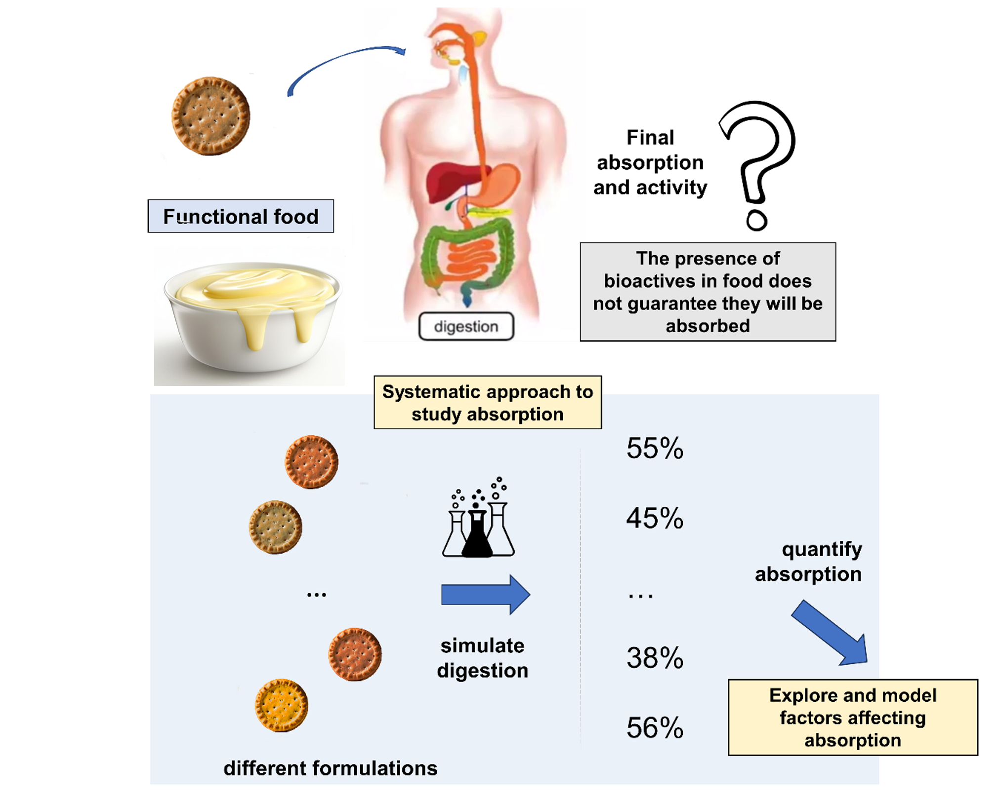
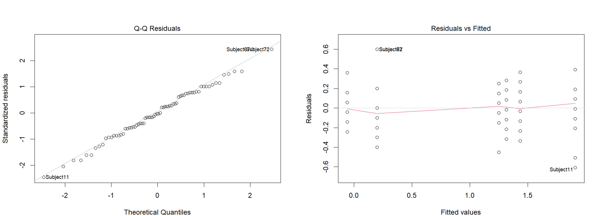
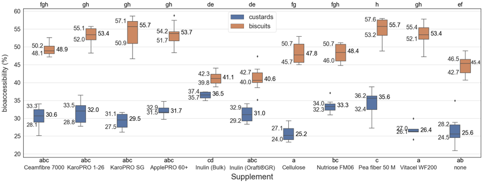
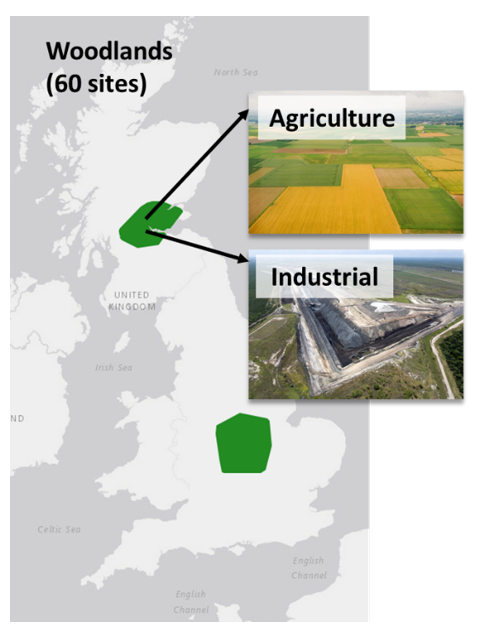
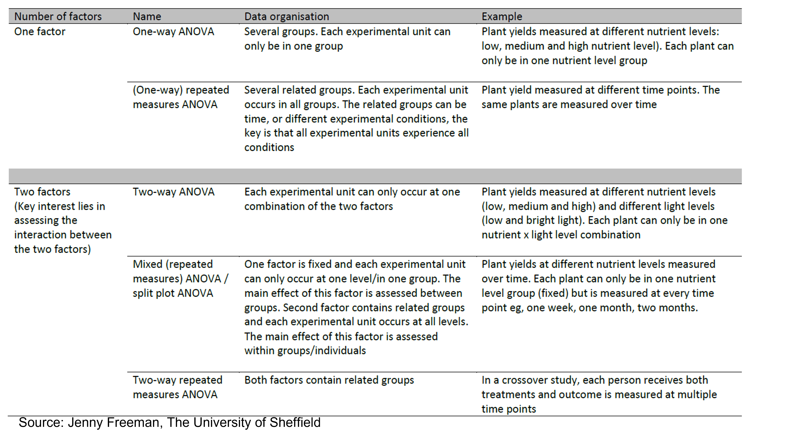

```{r, setup, include=FALSE}
## 1. First set the working directory
knitr::opts_knit$set(root.dir ="~/Bioinformatics_MSc/Teaching/Data Science Summer Course/Course Material/Lipton_Training_April_2025/Lectures")
```

# Statistical Foundations Part3

```{=html}
<style>
    .div-1 {
        background-color: "white"; text-align:left;
    }
    .fragment {
        background-color: "white"; text-align:left;
    }
</style>
```
<body>

::: div-1
# Other Types of ANOVA
:::
## Introduction

<br>

- The ANOVA examples we have considered so far in the course are one-way ANOVA since they involve only one factor, e.g. fibre type or wheat cultivar. <br><br>

. . .

- If for the Bioaccessibility example we had considered two factors—e.g. fibre type AND food matrix type we would have to use something called a two-way ANOVA. 

## Bioaccesibility Experiment

{fig-align="centre" width=70%}

## Interaction effect
<br>
<style>
div.gray { background-color:#ebf5ed; border-radius: 5px; padding: 20px; text-align:left;}
</style>
<div class = "gray">
<font size="6"> A two-way ANOVA on data from the Bioaccessibility experiment would tell us whether Bioaccessibility was affected by:</font></div> <br>

. . .

<font size="6">▪️ Fibre Type --> **Main Effect**</font><br>

. . .

<font size="6">▪️ Food Type --> **Main Effect**</font><br>

. . .

<font size="6">▪️ Fibre/Food combination --> **The Interaction Effect**</font> <br>

## Interaction effect

<style>
div.gray { background-color:#ebf5ed; border-radius: 5px; padding: 20px; text-align:left;}
</style>
<div class = "gray">
<font size="6">
The interaction effect tells us whether the effect of Fibre depends on Food Type (and vice versa). </font>
</div> <br>

. . .

#### Two-Way ANOVA R syntax
<font size="6">
`bioaccess.anova<-aov(Bioaccessibility~Fibre*Food, data=bioaccess)`
</font>


## Two-way ANOVA Assumptions


 

## Post-Hoc Tests

. . .

<font size="6">If the interactions effect is significant we can do multiple comparison tests.</font> <br><br>

. . .

<font size="6">For example: `TukeyHSD(biaccess.anova)`</font>


## Results



## Nested ANOVA

. . .

<font size="6">▪️ The two factors in the two-way ANOVA design are known as **factorial**:</font><br><br>

. . .

<font size="6">▪️ We have every combination of every level of each factor.</font><br><br>

. . .


<font size="6">▪️ If the levels of one of the factors appear in only one level of the other factors we have **nested** factors</font>

## Nested factors
<br>

. . .

- If levels of factor B appear in only one of the levels in factor A, factor B is termed **nested within factor A**. <br><br>

. . .

- To symbolise that factor B is nested with A we write **B(A)**. <br><br>

. . .

- Nested designs are quite common in ecology and environmental sciences.<br><br>

## Example of Nested Design
<br>
<div style= "float:right;position: relative; top: -50px;">
{width=60%}
</div>

. . .

<font size="5">▪ We conduct an experiment to test the soil pH in Agricultural vs Industrial land. </font><br>

. . .

<font size="5">▪ We have the factor Treatment with 2 levels (Agricultural and Industrial).</font> <br>

. . .

<font size="5">▪ We have 4 areas nested within each treatment and 5 soil samples in each area.</font>

## Nested ANOVA in R

. . .

<font size="5"> ▪ The previous design is nested because an area cannot belong to both the Agricultural and the Industrial group.</font><br>

```{r, echo=FALSE}
pH.soil <-read.table("Data/pH_soil.csv", sep=",", header=TRUE)
```

```{r}
nested.anova <- aov(pH ~ Treatment + Area %in% Treatment, data = pH.soil)
summary(nested.anova)
```
. . .

<font size="5">p>0.05 for the nested factor --> the pH variance within areas in the same group is small. </font>

## Fundamental ANOVA assumptions
<br>
<style>
div.gray { background-color:#ebf5ed; border-radius: 5px; padding: 20px; text-align:left;}
</style>
<div class = "gray">
<font size="6">
1. The population from which samples are drawn should be normally distributed.<br><br>
2. Homogeneity of variance: Homogeneity means that the variance among the groups should be approximately equal.<br><br>
3. Independence of cases: the sample cases should be **independent** of each other.</font>
</div>

## Repeated Measures ANOVA
<br>

. . .

<font size="5">▪️ A study design with repeated measures data has multiple dependent variable observations collected at several time points. </font><br>

. . .

<font size="5">▪️ This design violates the samples independence assumption.</font><br>

. . .

<font size="5">▪️ For time course experiments we can use a **repeated measures ANOVA**.</font><br>

. . .

<font size="5">▪️ A repeated measures ANOVA accounts for the **correlation** within and between experimental groups along with the time of the measurements (time point 1, time point 2, ...).</font> 


## ANOVA and Repeated Measures ANOVA Summary


 