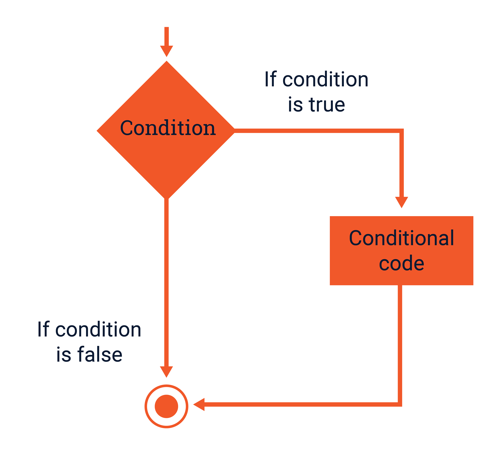
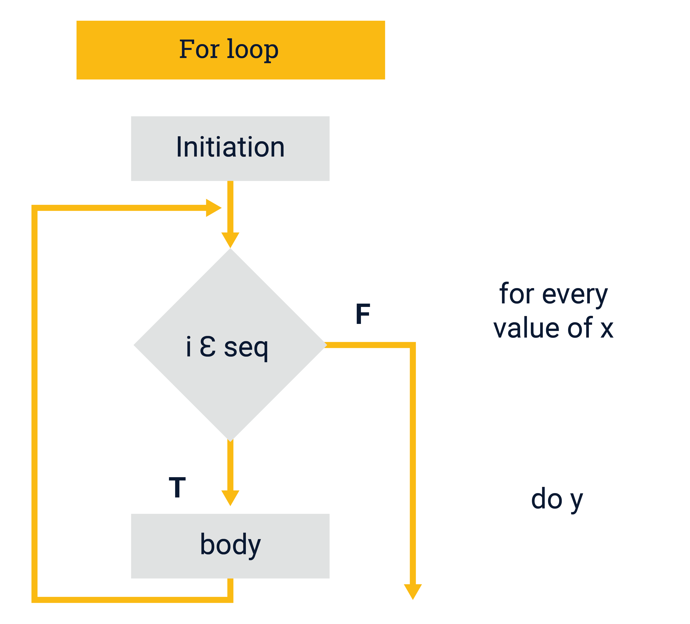

```{r setup, include=FALSE}
knitr::opts_chunk$set(echo = TRUE)
```

# Programming in R

**Aim**: Become familiar with the fundamental programming skills required to create your customised R scripts for data analysis. 


## R Statements
R provides the following decision-making statements:<br>

* If Statement
* Else Statement
* Else If Statement
* Switch Statement
* Break Statement

In this course we will learn about the first three statements in the above list. 

## The If Statement
The `if` is a control statement which represents an instruction to R to do something *if* a condition is met. It consists of a Boolean expression and a set of statements. 
<br>
{fig-align="center" width=70%}


The syntax for the `if` statement goes as follows:<br>
`if(A) {Z}` <br>

Where `A` is the condition and `Z` is the action carried out *if* the condition in the parenthesis is met!<br>
<style>
div.gray { background-color:#ebf5ed; border-radius: 5px; padding: 20px;}
</style>
<div class = "gray">
⚠️**Important**: The condition must have only one element that evaluates to a **single** logical value. It CANNOT be a vector as R will only look at the first element and execute accordingly.</div>

Let's see a simple example: 
```{r}
num <- 5
if(num < 0) {
  print("this is a negative number")
}
```
If you execute this code nothing gets done, because the condition is not met; i.e. num < 0 is FALSE. 

Now let's change the value of num to a negative number and run the code again:
```{r}
num <- -5
if(num < 0) {
  print("this is a negative number")
}
```
As you can see this time we got a response from R!
We could change the above code a little so R converts negative values to positives:
```{r}
num <- -5
if(num < 0) {
  num <- abs(num)
  print(num)
}
```

### Else Statement
Sometimes only doing an action when a condition is met is not enough. We may actually want to define an alternative action which happens when the condition is not met. This is a job for the *Else* statement. This is basically a **plan B** given to R when the if condition is no satisfied. 

Let's replicate the first example but this time give an alternative action. To make it a little more interesting we will create a vector with 10 numbers, some positive and some negative. Then we will randomly sample one element from this vector and use the if-else statement to assess it:
```{r}
# Create number vector
number.vector <- c(2, -2, 4, 1, 5, -6, -3, 8, 15, -13)
# Randomly select a number
num <- sample(number.vector, size = 1)
print(num)
# Assess if the num variable meets the condition set. Alternatively do something else
if(num < 0) {
  num <- abs(num)
  print(paste("New number values is ", num))
  } else {
  print(paste("Number", num, "is already positive"))
}
```

### Else-If Statement
How about if we had zeros inside our previous vector? We haven't covered this possibility. Or if we also want to find the values that are positive and less than 10 and do something else with them? Fortunately we can employ the *Else - If* statements and add as many alternatives as we like. 
Let's see an example:
```{r}
# Create new number vector
number.vector1 <- c(2, 0, -2, 4, 0, 1, 5, -6, -3, 8, 15, -13, 18, -14, 12, 0, 0)
# Randomly select a number
num <- sample(number.vector1, size = 1)
print(num)
# Assess if the num variable meets the condition set. Alternatively do something else
if(num < 0) {
  num <- abs(num)
  print(paste(" the new positive number is:", num))
  } else if(num == 0) {
    print("this number is exactly zero")
    
    } else if(num > 0 & num <10) {
      num <- num + 10
      print(paste("The new number has increased to:", num))
    } else if(num > 0 & num >10) {
      num <- num -10
      print(paste("The new number has decreased to:", num))
    }
```
You can play around yourselves and see what it does. 

## R Loops
* For Loop
* Repeat Loop
* While Loop

A loop in R is simply a method to automate a task that has multiple steps. In this course we will learn about the `for` loop which is one of the most frequently and useful loops. 
<br>
<br>

### For Loop  

A `for` loop is the most popular control flow statement. A `for` loop is used to iterate a vector and repeats the same operation many times each time using a different element from the input vector.
A `for` loop in R is represented by the following elements as shown in the schema below: The **initiation** element, the **decision** element and the **body**.
<br>
<br>
{fig-align="center" width=70%}
<br>

- The *initiation* element contains the R object with a set of values. For example it can be a vector x which contains the sequence of elements which the `for` loop will iterate the code included in the *body*. 
- The **decision** element is where the loop checks whether the value it is currently handling actually belongs to vector x (the initiation sequence).
- The **body** contains the code which will be iterated for each value within x. This is the *y* in the schema above. 

The syntax for a `for` loop looks like this: <br>

`for(value in x){y}` <br>

We can look at a simple example involving the vector `number.vector` we created in the previous section. 
```{r}
for(number in number.vector){
  print(number)
}
```
**NOTE:** What we name the value in the parenthesis is totally up to us. In this case we called it *number* but we could equally call it *i*, *z*, *element* and so on. 

### Combining `for` loops with `if` and `else` statements
If you remember in the previous section we said that the `if` statement doesn't work for a vector. But what happens when we want to go through all the elements within a vector and check for a condition? We can employ a `for` loop. Take as an example the `number.vector` again and evaluate whether the elements within the vector are positive or negative:
```{r}
for (number in number.vector){
  if(number < 0) {
    print(paste("Number", number, "is negative"))
  } else {
    print(paste("Number", number, "is positive"))
  }
}
```
<style>
div.gray { background-color:#ebf5ed; border-radius: 5px; padding: 20px;}
</style>
<div class = "gray">
**NOTE:** Something important to keep in mind is that a `for` loop does not return an output. The only reason we have seen an output is because we explicitly asked R to print the output in the console. If we want to save the output of every iteration we can create an empty object -usually a vector- which will be gradually populated with the result of every iteration. </div>

Let's see an example: First create an empty vector: 
```{r}
new.vector <- c()
```
If you print the contents of this vector the output is `NULL`. 

Now create a loop which will iteratively assign the values of `number.vector` to the empty `new.vector`:
```{r}
for(i in 1:10){
  new.vector[i] <- number.vector[i]-5
}
```

Finally print the new.vector in the console:
```{r}
new.vector
```
As you can see the new.vector is no longer empty

<style>
div.gray { background-color:#ebf5ed; border-radius: 5px; padding: 20px;}
</style>
<div class = "gray">
⚠️**Note**: Many of the examples we provided earlier on how to create decision statements and `for`loops can be easily performed in R using vectorisation. This is one of the main advantages of R. However, there are cases when we cannot avoid using Statements and Loops. </div>


## Building Functions in R

In our brief journey through R we have already come across the concept of functions and had the opportunity to use some R functions, such as `mean()`, `seq()`, `sum()` etc. These are built-in R functions that are stored in a special internal form. Apart from using built-in functions or functions available through a package, it is also useful to learn how to create our own functions as this can help our code become more elegant, less complex and more productive. 

A function is defined by an assignment of the form:

`function.name <- function(arg_1, arg_2, …arg_i) {expression}`

To create a new function we use the function `function()` and inside the parenthesis we define the arguments. We can add only one argument or as many as we want. The arguments are used to calculate a value(s) within the `expression` part of the function. The value of the expression is the value returned when we call the function.  
To call the function we need to write the name of the function and provide the argument values inside the parenthesis: `function.name(arg_1, arg_2, ..., arg_i)`.  

**Saving the results of a function:** Another important thing we need to remember when building a function is that any object created withing the body of the function belongs to the **Local Environment**. This means that if I try to view this object after I have called the function it will not be available! To make it available to the Global Environment we need to use the `return()` function within the body of the function we created. This will return the result of the function into a new variable or list of variables. 

<br>
{fig-align="center" width=80%}

### Example:

Let's see a very simple example of how to built a function in R:
Assume we want to create a function which takes a value `x` and returns the natural logarithm of x `log(x)` multiplied by 5:
```{r}
ln_function <- function(x=numeric()){
  y <- 5*log(x)
}
```

Let's try to run the function by providing a value for x:
```{r}
ln_function(12)
```

As you can see there is nothing returned. This is because earlier when we created the function we didn't specify what variable to return. Let's write the function again, but this time include the `return()` function inside the body:
```{r}
ln_function <- function(x=numeric()){
  y <- 5*log(x)
  return(y)
}
```

Now call the function again:
```{r}
ln_function(12)
```

As you can see R returns the result of the calculation happening in the background. 

**NOTE 1:** The function `ln_function` we created earlier can also take a vector of numeric values as argument. 


**NOTE 2:** ⚠️ If we don't provide any argument when calling the function or we provide an argument of the wrong data type then R will return an **error**. <br><br>

**For example**: Run `ln_function("150")` in a code chunk and see what happens. 
```{r}

```

**NOTE 3:** When calling a function we can create new variable to assign the results of the function. E.g:
```{r}
ln1 <- ln_function(150)
ln1
```

When creating a function we can also define default values for our arguments. In this case if we don't provide any arguments when calling the function, R will run the function with the default value. For example:
```{r}
ln_function <- function(x=25){
  y <- 5*log(x)
  return(y)
}
```

Now run the function without providing any argument value. What do you get back?

**Exercise:** Create a function called `avg()` which takes a numeric vector as argument. The function evaluates every element in the vector and if it is <5 it replaces it with the value 5. It then returns the new vector and the mean value of the (new) elements in the vector. <br>

Next call the function and give a numeric vector as argument, e.g. (8, 4, 1, 17, 12, -2). 

Hint: You can use the function `replace()` to create the new vector. The general syntax is `replace(data, condition, new value)`.
