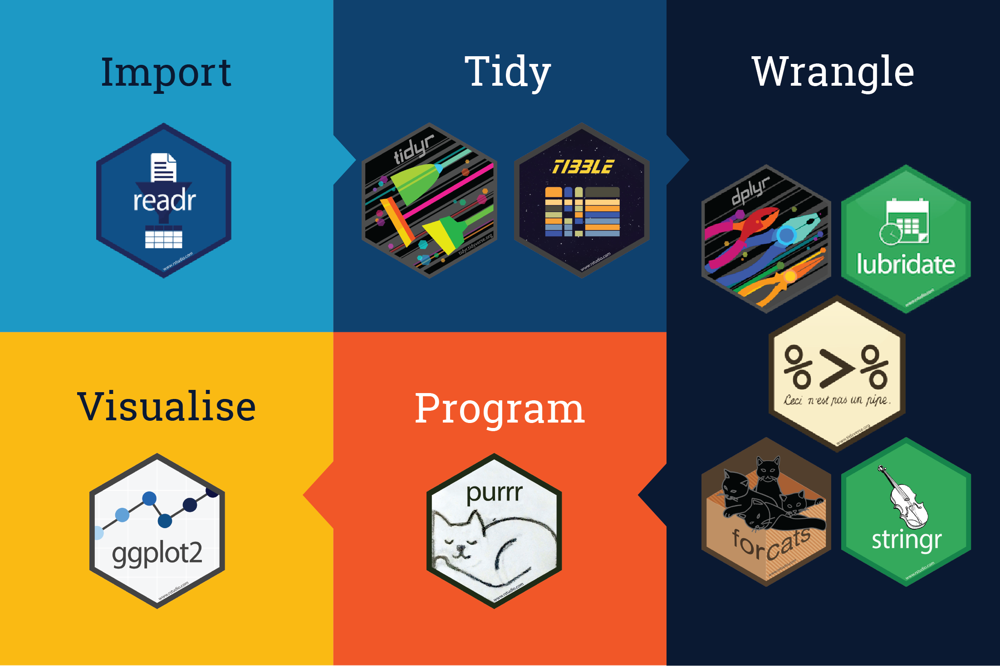

# Data visualisation with ggplot2

## Introduction

One of the major strengths of R is its strong data visualisation capabilities. The R ecosystem includes many different packages that support data visualisation. The three most widely used are: <br>
1) the base graphics system, which uses the **graphics** package 
2) the **lattice** package
3) the **ggplot2** package

Today we will learn the basic syntax and rules related to the **ggplot2** library which enables us to create publication quality graphs. 

The ggplot2 library is part of the **tidyverse** ecosystem. The tidyverse is a collection of R packages designed for data science. All packages share an underlying design philosophy, grammar, and data structures. (https://www.tidyverse.org/) <br><br>

{fig-align="center" width=80%}
<br><br><br>
**ggplot2** in particular is a data visualisation package for creating aesthetically pleasing graphics. To access `ggplot2` we can either install ggplot2 directly or install tidyverse which will provide access to all the packages in the ecosystem. 

`install.packages("tidyverse")`

Or alternatively:

`install.packages("ggplot2")`


The ggplot2 package was developed by Hadley Wickham to implement some of the ideas in a book called *The Grammar of Graphics* by Wilkinson (2005). ggplot2 has adopted the language laid out in this book to define graphical objects, which is quite different to base R. This can make it a little difficult to get the hang of it, but once you have mastered the basics it will not take you long to produce sophisticated plots.

## ggplot2 grammar

A default ggplot needs three things the user needs to specify: 
1) the data
2) the aesthetics
3) the geometry. 

* **Data**: This term refers to the raw data that we want to plot.<br>
* **Aesthetics aes()**: This term refers to aesthetics of the geometric and statistical objects, such as the position, colour, size, shape, and transparency.<br>
* **Geometry geom_**: The geometric shapes that will represent the data.<br>
These terms might not make much sense right now, but we will see how they work in practice. 

Further Reading: https://ggplot2-book.org/index.html


For this tutorial you will need to install and load the following packages:

```{r, warning=FALSE, message=FALSE}
library(tidyverse)
library(patchwork)
library(plotly)
library(highcharter)
library(ggiraph)
library(forecast)
```


## Data source
The data for this tutorial are from the MET Climate Series (https://www.metoffice.gov.uk/research/climate/maps-and-data/data/index).
The UK climate series have been recreated from the HadUK-Grid dataset which is a collection of gridded climate variables derived from the network of UK land surface observations. The data have been interpolated from meteorological station data onto a uniform grid to provide complete and consistent coverage across the UK. 
The dataset spans the period from 1836 to present, but the start time is dependent on climate variable and temporal resolution. The grids are produced for daily, monthly, seasonal and annual timescales, as well as long term averages for a set of climatological reference periods. 

**Dataset**: Today you have been supplied with a csv file named **Heathrow_MET_Data.csv** which represents the monthly average values for Max daily temperature, Min daily temperature, hours of sunshine per month, hours of rainfall per month and days of frost per month, recorded for the area of Heathrow between 1957 - 2022.

## Import data

First set your working directory:
```{r}
##setwd()
```

Then use the `read.csv()` function to import the dataset into the R environment:
```{r}
heath <- read.csv("", sep=, header = , stringsAsFactors = FALSE) ## Fill in the arguments
```

We can inspect the data frame `heath` we just created by printing the first 10 rows:
```{r}
head()
```

and the last 10 rows:
```{r}
tail()
```

We can also use the function `str()` to check the contents of the dataframe:
```{r}
str()
```

As you can see from the output of the above function the column *Date* is of type `chr`. We first need to convert it into type `Date` before we carry out any analysis. 
```{r}
#Convert last column from chr to date
heath$Date <- as.Date(heath$Date, format =  "%d/%m/%Y")
```

Now check the structure again to make sure it has been successfully converted:
```{r}
str()
```

The following step is to extract a dataframe with only the years from 2017-present in the dataset:
```{r}
heath_5 <- dplyr::filter(heath, Year > 2016)
```
💡 **NOTE:** The `filter()` function is part of `dplyr` and can be used for subsetting dataframes.


## Use ggplot2 to explore the new dataset:

The first plot we can make using the heath_5 dataset is a simple scatter plot of `maxTemp` vs `Date`. 

These variables are called **positional** aesthetics as they map to the x and y positions. 

### Create a graphical object and add aesthetics 
The first thing to do is create a graphical object (*ggobject*) and store it as variable `g`. This is an arbitrary name for naming our graphical object. 
```{r}
g <- ggplot(heath_5, aes(x = Date, y = Tmax))
```
As you can see in the previous line of code the main function for creating the ggobject is `ggplot()`. The first argument within this function is the dataset `heath_5` and the second argument is another function, the `aes()` function which defines the **aesthetic mappings** `x=Date` and `y=Tmax` (positional aesthetics).

**NOTE:** ggplot2 is very flexible. We can arrive to the same result using different strategies. However the approach presented above is the most commonly used approach for setting up a graphical object with default data and aesthetic mappings.

### Provide a Geometry (layer)
I am sure you haven't failed to notice that we still haven't created any plots! In order to produce a plotable version of object `g` we need to specify a **layer**. ggplot2 provides a number of functions that add layers according to the type of geometry (geom) they use. They look like this: **geom_NAME**, where NAME stands for the name of the different possible geoms. Some of the available geoms are:

`g + geom_point()`

`g + geom_line()`

`g + geom_line() + geom_point()`

To create a scatterplot we need the `geom_point()` geom:
```{r}
g + geom_point()
```

## Customising plots

### Change the properties of geoms:
The plot we created earlier is pretty basic. We can modify it by changing the properties of the geom, e.g. change the colour, size, shape or type of the datapoints, or lines if we are using a different geom. 
For example:
```{r}
g <-g + geom_point(colour = "blueviolet", shape = "diamond", size = 4, alpha = 0.3)
g
```

**NOTE:** The `alpha` parameter determines transparency. It takes values from 0 to 1 and the smaller the alpha value is the higher the transparency. 

### Setting colours 

In R we have a large range of available colours we can use to create and customise plots. There are also different ways to assign those colours. The easiest way is to type the colour name e.g "cyan". The table below shows the available colour names we can use to customise our ggplots. To find out more about the other methods we can use to assign colours check this link: https://r-graph-gallery.com/ggplot2-color.html?utm_content=cmp-true

{fig-align="center"}

We can add a line as well to join the datapoints with `geom_line()`:
```{r}
g <- g + geom_point(colour = "blueviolet", shape = "diamond", size = 4) +
  geom_line(colour = "blueviolet", linetype = "dotted", linewidth = .3)
g
```


### Change background

We can change the not so appealing default grey theme of ggplot2 to a different background theme. A good choice is the classic dark-on-light ggplot2 theme `theme_bw()`:
```{r}
theme_set(theme_bw())
```
**NOTE:** We can either change the theme for all the plots as we did it above, or change the theme for a specific plot by using the `+` symbol, e.g.: `g + theme_bw()`

There are many more themes to explore: some are the following:

* theme_linedraw()
* theme_light()
* theme_dark()
* theme_classic()
* theme_void()


## Customising the axis

We can also customise the axis, such as adding labels and units, changing the colour, font, size etc.

### Add labels and units to axis
To add axis labels we can use the `labs()` function to do it in one step:
```{r}
g + labs(x = , y = ) ## Provide labels for the different axis
```

or add labels for x and y separately:
```{r}
g + xlab() +   ## Ditto
    ylab()
```

💡**NOTE:** Previously we manually typed `C` for the temperature units. However, ggplot2 allows us to add symbols such as unit symbols with the function `expression()`: 
```{r}
g + labs(x = "Date", y = expression(paste("Temperature (", degree ~ C, ")")))
```

**The above is for reference only!** You are not expected to write expressions during this course. 


### Increase space between axis and axis title
To control how close the axis label is to the axis you can use the `theme()` function. 
For example:

```{r}
g + labs(x = , y = ) +    ## Add axis labels
    theme(axis.title = element_text(vjust = ))   ## Add a value for vjust between 0 and 1
```
<br>
**NOTE:** `vjust` refers to the vertical alignment, which usually ranges between 0 and 1. When `vjust = 0` the axis title is further away from the title. There is also the argument `hjust` which controls the distance of the title from the axis origin. The argument`size` controls the font size for the axis title.

### Modify axis title
We can further modify the axis title aesthetics by changing the colour, font etc. 
For example:
```{r}
g + labs(x = , y = ) +   ## Add axis labels
    theme(axis.title = element_text(vjust = , size = , colour = , face = "bold")) ## try different values for the parameters in the axis title aesthetics
```

### Modify x and y axis title separately
Earlier we applied the same aesthetics to both x and y axis at the same time. If we want to change the aesthetics of each axis title separately we can do it like this:
```{r}
## Fill in the missing parameters and labels below
g + labs(x = , y = ) +
    theme(axis.title.x = element_text(vjust = 0.5, angle = 50, size = 15, colour = "blueviolet", face = "italic"),
          axis.title.y = element_text(vjust = , size = , colour = ,  face = ), 
          axis.text.x = element_text(angle=60, hjust=1)) +
   scale_x_date(date_breaks = "1 year", date_labels = "%Y")
```


### Remove axis ticks and numbers
The function `theme()` is versatile and can be used to modify other aspects of the axis aesthetics. For instance we can use it to remove axis ticks and numbers:
```{r}
  g + labs(x = , y = ) +
      theme(axis.ticks.y = element_blank(),
            axis.text.y = element_blank())
```

### Set axis limits
A useful operation when creating plots is setting axis limits to control the axis scale. To do this we can use the functions `ylim()` and `xlim()` for axis y and x respectively. 
For example:
```{r}
g + labs(x = , y =) +
    ylim(c()) # provide the min and max y-axis limits
```


### Add graph title

To add graph title we can use the ggtitle() function:
```{r}
g + labs(x = , y = ) +  # Add axis labels
    theme(axis.title = element_text(vjust = , size = )) +  # Add aesthetic values
    ggtitle()  # Add plot title
```


#### Colour code the plot according to a specific variable 
<br>
**A) Colour points according to a discrete variable:**

Our `heath` weather dataset contains a column called `Season`. To see the impact of `Season` on `Tmax` we can plot `Tmax` against the variable `Date` and colour-code our plot based on the variable `Season`. This is very useful as it adds extra information and helps with result interpretation. <br>
It is very easy to do this using ggplot2 as demonstrated in the example below:
```{r}
ggplot(heath, aes(x = Date, y = Tmax, colour = Season)) +
  geom_point()+ 
  labs(x = "Date", y = "Temperature ((C)")
```
<br>
As you can see ggplot2 adds a legend by default when we map a variable to an aesthetic.
<br><br>
**B) Colour points according to a continuous variable:**

In the previous example the variable `Season` was categorical. However, we can also use continuous variables to colour-code a plot. 
For instance we can colour the points in the previous plot according to the hours of sunshine: 
```{r}
ggplot(heath, aes(x = Date, y = Tmax, colour = Sun)) +
  geom_point() +
  labs(x = "Date", y = "Temperature (C)", colour = "Sunshine (h))")
```


### Arrange different graphs on the same page

If we want to arrange different ggobjects on the same page, there are packages which help us do this. Examples include library **patchwork** and **cowplot**. 

To begin with let's create two different ggobjects and save them under variable names `p1` and `p2`. 

a) Create a scatterplot of `Date` vs `Frost_days`
```{r}
p1 <- ggplot(heath, aes(x = , y = , colour = )) + # fill in the arguments
        geom_point() +
        labs(x = "Date", y = "Frost (days)")  # add labels
```

b) Create a scatterplot of `Date` vs `Sun`:

```{r}
p2 <- ggplot(heath, aes(x = , y = )) +  # fill in the arguments
  geom_line(colour = ) +          # Choose a colour for the line
  geom_point(colour = ) +        # Choose a colour for the dots
  labs(x = , y = )              # add labels

```

c) We will use library patchwork and display p1 and p2 side by side:
```{r}
#library(patchwork)
p1 + p2
```

d) To display one under the other we can type:
```{r}
p1 / p2
```

We can also make combinations based on the syntax showcased earlier. 

For example, for three graphs we can arrange them as follows:
```{r}
# Create variable g1 to store a graph for `Date` vs `Rain`
g1 <- ggplot(heath, aes(x = , y = )) +  # Fill in arguments
  geom_point(colour = )+                # Chhose a colour for the dots
  labs(x = , y = )                      # Add axis labels

# Arrange the tree plots:
(g1 + p2) / p1
```

### Superimposing two graphs 

When analysis and presenting your results, in some cases you may want to overlay two plots on the same graph to look at trends simultaneously. ggplot2 can accommodate this by adding additional geoms. 

**Example** For this particular dataset let's suppose we want to look at `Tmax` and `Rain` trends during the last 5 years. Below we show the syntax we need to follow to achieve this:
```{r}
ggplot(heath_5) + geom_line(aes(x=Date, y=Tmax, colour = "Tmax (C)"), linewidth = 0.6)+ 
  geom_line(aes(x=Date, y=Rain, colour = "Rain (mm)"), linewidth = 0.6)+
  labs(x = "Date", y="", title="Max Temp and Rain in Heathrow") +
  scale_colour_discrete(name="Legend") 
```

As you can see there are some important changes compared with how we visualised the plot for only `Tmax` earlier. <br>

a) The first change was that we didn't define any positional aesthetics within the `ggplot()` function. Instead we added one geom per each dataset and defined the positional aesthetics  within the respective `geom_line()` functions. <br>

b) We also defined the line colour for each plot within its respective geom. However, instead of assigning a random colour from a colour palette like we did earlier, we assigned the colour according to each variable we wanted to visualise (`colour = "Tmax"` and `colour = "Rain"`). As a result the variable name also appears in the legend . <br>

c) The last line of our code assigned a legend title. 

## Different types of plots
Apart from scatter plots and line plots we usually employ some common types of visual representation to get a better feel for the data. 

### Histograms
Histograms are useful to see the distribution of a specific variable. For instance the distribution of Sunshine duration can be visualised as follows:
```{r}
ggplot(heath, aes(x=Sun, fill = Season)) + 
  geom_histogram(binwidth = 15) +
  labs(x = "Time (h)", y = "Sunshine") +
  ggtitle("Histogram of Tmax (C)")
```

### Boxplots
A boxplot is a standardised way of displaying the distribution of data based on a five number summary (“minimum”, first quartile [Q1], median, third quartile [Q3] and “maximum”).

```{r}
ggplot(heath, aes(x = Season, y = Sun, fill = Season)) +
    labs(x = "Season", y = "Sunshine") +
    geom_boxplot()
    ggtitle("Boxplot of sunshine (h)")

```

Other variants of boxplots are the violin plots 
```{r}
ggplot(heath, aes(x = Season, y = Sun, fill = Season)) +
    labs(x = "Season", y = "Sunshine") +
    geom_violin(size = 0.5, alpha = 0.5)
    ggtitle("Boxplot of sunshine (h)")
```


### Barplots
Let's create a new dataframe with the August maxTemp values between 2017-2023 in the `heath` dataset. 
```{r}
aug <- filter(heath_5, Season ==, Month_numeric == ) ## Fill in the arguments
```

To make a barplot we need the geom_bar() function and define `stat="identity"`:
```{r}

ggplot(aug, aes(x = Year, y = Tmax, fill = as.factor(Year))) +  #define year as factor or it will show as continuous variable
    labs(x = "Year", y = "maxTemp") +
    geom_bar(stat="identity")+
    ggtitle("Barplot of August max Temperatures") +
    guides(fill=guide_legend(title="Year")) # define the legend title
```
<br>
In this barplot we filled the bar colour based on the variable `Year` which we converted to factor first. 

If we want to have more control over the bar colour we can use a colour pallette, e.g. RColorBrewer:
```{r}
ggplot(aug, aes(x = Year, y = Tmax, fill = as.factor(Year))) +
    labs(x = "Year", y = "maxTemp") +
    geom_bar(stat="identity")+
    scale_fill_brewer(palette = "Set2") +
    ggtitle("Barplot of August max Temperatures")
```


### Smoothing
A useful technique when interested to look for trends in time series or to de-noise your data is **smoothing**. ggplot2 provides the option to apply **LOESS** (locally weighted scatter plot smoothing) method. To do this we need to add the `stat_smooth()` function to the ggplot. 
```{r}
spring <- filter(heath, Season == "Spring")

ggplot(spring, aes(x = Date, y = Tmax)) +
  geom_point(colour = "darkcyan")+ 
  labs(x = "Date", y = "Max Temperature ((C)") +
  geom_smooth(method="loess", span = 1) +
  ggtitle("Annual Max Spring Temperatures")
  
```

We can change the `span` values to achieve the result we want. Small span numbers make a wigglier curve, accounting for localised trends, while larger span numbers create a smoother curve, showing the long-term trend. 


### Interactive graphs
Finally we can combine ggobjects with other libraries which allow us to create interactive graphs. Examples include library **plotly**, **ggiraph** and **highcharter**.


#### plotly
To use **plotly** we just need to call the function `ggplotly` and provide a ggobject as an argument. 
```{r}

g3 <- ggplot(heath, aes(x = Season, y = Sun, fill = Season)) +
         labs(x = "Season", y = "Sunshine") +
         geom_boxplot()
         ggtitle("Boxplot of sunshine (h)")

# Use function `ggplotly()` to convert g3 into an interactive plot
ggplotly(g3)
```
In the previous example we created an interactive boxplots. If you hover on top of each boxplot you can see further information appearing which can be very helpful for data exploration and interpretation. 

#### ggiraph

First create a ggobject using `geom_point_interactive()`
```{r}

library(ggiraph)
  
gr <- ggplot(heath, aes(Date, Tmax)) +
  geom_line(colour = "grey") +
  geom_point_interactive(
    aes(colour = Season, tooltip = Season, data_id = Season)
  ) +
  scale_colour_brewer(palette = "Dark2", guide = "none") +
  labs(x = NULL, y = "Temperature (C)") +
  theme_bw()
```
 
 Then pass this object as argument to the `girafe()` function.
```{r}
girafe(ggobj = gr)
```

#### highcharter
```{r}
library(highcharter)

hchart(heath_5, "bar", hcaes(x = Date, y = Tmax, group = Season))
```

```{r}
library(forecast)
## Forecast monthly deaths from lung disease in the UK
mortforecast <- forecast(auto.arima(fdeaths), level = 95)

hchart(mortforecast)
```


